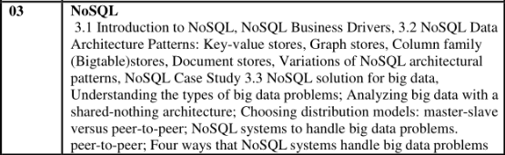

**NoSQL** databases are a category of database management systems (DBMS) that provide an alternative to traditional relational databases (RDBMS).

designed to ==handle large volumes== of diverse and complex data, ==support high scalability, and enable flexible data modeling.==

NoSQL databases ==are ideal for big data, real-time web applications,== and other use cases where the rigid schemas and transactional consistency of relational databases are not necessary or practical.

**Defination** : "NoSQL" stands for "Not Only SQL," highlighting that these databases do not strictly adhere to the traditional relational model

NoSQL databases offer flexible data models and ==can handle unstructured, semi-structured, and structured data.==

**Scalability**: Designed for ==horizontal scalability==, NoSQL databases can handle growing volumes of data by ==adding more servers rather than increasing the capacity of a single server.==

#### Characteristics of NOSQL
- schema flexibility
- scalability
- high performance
- Distribution : often ==distributed across clusters==, which helps in ==balancing load ==and enhancing fault tolerance.
- Data Structure Flexibility: support various data formats, ==including JSON, XML, BSON, and binary formats==, making it easier to handle diverse data types.

#### Types of NoSQL Databases

##### 1. **Key-Value Stores**

- **Structure**: ==Data== is ==stored== as ==simple key-value pairs==, where each key is unique, and values can be any type of data, such as ==strings, JSON, or binary data.==
- **Performance**: ==Highly efficient== for retrieving data by key, making them suitable for caching and session management.
- **Examples**: ==Redis, DynamoDB, Memcached, Riak==,azuretables.
- **Use Cases**: ==Caching, user profiles, session management, real-time recommendations.==

##### 2. **Document Stores**

- **Structure**: Data is stored as documents in ==formats like JSON or BSON==, which ==allows a flexible schema and hierarchical data storage.==
- **Document Model**: Each document can have ==different fields, and fields can be nested, making it ideal for semi-structured data.==
- **Examples**: ==MongoDB, CouchDB, Amazon DocumentDB==.
- **Use Cases**: Content management, ==product catalogs==, user profiles, ==e-commerce data==, and any application requiring hierarchical or complex data.

##### 3. **Column-Family Stores**

- **Structure**: Data is ==organized in rows and columns== but ==differs from relational databases in its storage structure, as columns are grouped into "column families."==
- **Column Families**: ==A column family is a container for rows, where each row can contain different columns within the same family. This model is optimized for reading and writing large datasets across distributed systems==.
- **Examples**: ==Apache Cassandra, HBase, ScyllaDB.==
- **Use Cases**: ==Real-time analytics, time-series data, recommendation engines, IoT data.==

##### 4. **Graph Databases**

- **Structure**: ==Data is stored in nodes, edges, and properties, representing entities, relationships, and attributes, respectively.==
- **Graph Model**: Graph databases are ==optimized for complex relationships and connected data, making it easier to traverse relationships without complex joins.==
- **Examples**: ==Neo4j, Amazon Neptune, ArangoDB,hygraph==.
- **Use Cases**: ==Social networks, recommendation systems, fraud detection, network and supply chain analysis==.

#### **Core Concepts in NoSQL Databases**

##### 1. **CAP Theorem**

- **Definition**: CAP Theorem states that a distributed data store ==cannot simultaneously guarantee **Consistency**, **Availability**, and **Partition Tolerance**==.
- **Choices in NoSQL**: NoSQL databases often prioritize availability and partition tolerance, favoring eventual consistency over strict consistency.
    - **Consistency**: All nodes have the same data at the same time.
    - **Availability**: The system is always available for read and write operations.
    - **Partition Tolerance**: The system continues to function even if there’s a network partition or communication breakdown.

##### 2. **Eventual Consistency vs. Strong Consistency**

- **Eventual Consistency**: ==Data updates may not immediately reflect on all nodes==, but they eventually converge to a consistent state.
- **Strong Consistency**: Ensures that once an update is made, ==all nodes see the latest value immediately.==
- **Trade-Off**: Many NoSQL databases choose eventual consistency to optimize for availability and partition tolerance.

##### 3. **Sharding**

- **Definition**: Sharding is a technique ==used to partition data across multiple servers or nodes, improving scalability and performance==.
- **Horizontal Scaling**: Sharding ==allows NoSQL databases to distribute data and load across multiple nodes==, enabling horizontal scaling.
- **Implementation**: NoSQL databases like ==MongoDB and Cassandra== ==use sharding== to balance data across clusters.

##### 4. **Replication**

- **Definition**: Replication involves ==creating multiple copies of data== on different nodes or data centers for fault tolerance.
- **High Availability**: Replication ensures that if one node fails, other copies can still be accessed, making the system highly available.
- **Consistency Models**: Replication strategies can affect consistency; some databases offer tunable consistency to balance speed and reliability.

#### Advantages and disadvantages of nosql

| Advantages             | Disadvantages                  |
| ---------------------- | ------------------------------ |
| Schema Flexibility     | Lack of ACID Transactions      |
| Horizontal Scalability | Limited Query Capabilities     |
| Performance and speed  | [[Consistency trade-offs]]     |
| [[developer agencet]]  | [[Standardization Challenges]] |
| High Availability      |                                |
#### **Use Cases for NoSQL Databases**

##### 1. **Big Data Applications**

- **Description**: NoSQL databases are ==ideal for handling large and diverse data==, ==such as logs, clickstream data, or IoT sensor data==.
- **Examples**: Hadoop with ==HBase or Cassandra ==for ==high-throughput data storage and analysis.==

##### 2. **Content Management Systems (CMS)**

- **Description**: ==Document stores like MongoDB or Couchbase== are well-suited for CMS applications due to their schema flexibility.
- **Examples**: ==Storing articles, product descriptions, images, and media assets.==

##### 3. **Social Networking and Graph-Based Applications**

- **Description**: ==Graph databases like Neo4j== are optimized for storing and traversing complex relationships, which is essential for social networks.
- **Examples**: Friend connections, recommendations, and influencer analysis.

##### 4. **E-Commerce Applications**

- **Description**: NoSQL databases can handle product catalogs, inventory systems, and personalized recommendations, which need fast, flexible data access.
- **Examples**: Redis or DynamoDB for shopping carts, product recommendations, and session storage.

##### 5. **Real-Time Analytics and Monitoring**

- **Description**: In applications where real-time processing is critical, ==NoSQL databases like Cassandra or Redis provide high-performance, low-latency access.==
- **Examples**: Monitoring dashboards, financial tick data, and sensor readings for IoT.

#### **Popular NoSQL Databases and Their Specializations**

1. **MongoDB**: Document-oriented, schema-less, JSON-like storage, ideal for flexible data.
2. **Cassandra**: Column-family store designed for high availability, used in real-time data applications.
3. **Redis**: In-memory key-value store, used for caching and real-time applications.
4. **Neo4j**: Graph database optimized for relationship-based data and queries.
5. **DynamoDB**: Amazon's managed key-value and document database, known for high scalability.

#### RDBMS VS NoSQL

| RDBMS                                                                             | NoSQL                                                                                                 |
| --------------------------------------------------------------------------------- | ----------------------------------------------------------------------------------------------------- |
| ==Relational== (tables with rows and columns)                                     | ==Non-relational== (document, key-value, graph, or column family)                                     |
| ==Fixed schema== (predefined structure)                                           | ==Flexible schema== (dynamic and schema-less)                                                         |
| ==Enforces ACID properties== (Atomicity, Consistency, Isolation, Durability)      | Can support ACID in some cases but often relaxes consistency for scalability (BASE model)             |
| ==Vertical scaling== (adding more power to a single server)                       | ==Horizontal scaling== (adding more servers)                                                          |
| ==Uses normalization== to reduce redundancy                                       | Often ==denormalized== for faster access                                                              |
| SQL (==Structured Query Language==)                                               | ==Varies by database== (e.g., MongoDB uses JSON-like query language)                                  |
| ==Complex transactions and multi-row queries, consistency-critical applications== | ==Large-scale data, rapid development, unstructured or semi-structured data, real-time applications== |
| ==MySQL, PostgreSQL, Oracle, SQL Server==                                         | ==MongoDB, Cassandra, Redis, Couchbase==                                                              |
| ==Stores data in tables== with relationships                                      | ==Stores data as documents==, ==key-value pairs, graphs, or columns==                                 |
| May be ==slower== with very ==large== datasets                                    | Optimized for ==high-speed transactions== and large volumes of data                                   |
| ==Supports JOIN operations== to relate data across tables                         | Generally ==avoids JOINs==, uses embedded or linked data models instead                               |
| ==Strong transaction support== (multi-step transactions with rollback)            | Varies, ==typically lightweight transactions==, limited multi-document transactions                   |
| ==Strong consistency== by default                                                 | ==Often eventual consistency==, though some support strong consistency                                |
| ==Financial applications==, e-commerce, CRM                                       | ==Social media, IoT, content management, big data applications==                                      |
| ==Good at complex queries with multiple joins and aggregations==                  | ==Limited support for complex querying, may require custom code==                                     |
| ==Row-based storage==                                                             | ==Document, key-value, graph, or column-based storage==                                               |
| ==Established, mature technology with widespread use==                            | ==Newer, with rapid innovation and varied adoption==                                                  |
#### NoSQL Solution for big data

- Bulk Image Processing
- Public web page Data
- Remote Sensor Data 
- Event Log Data
- Mobile Phone Dhata
- Social Media Data
- Game Data 
- Open Linked Data

####  Explain Column family store and Graph Store NoSQL architectural pattern with example.

NoSQL databases are categorized based on their underlying data models and are optimized for specific use cases. The four primary types of NoSQL databases are:

1. **Key-Value Store**
2. **Document Store**
3. **Column Family Store**
4. **Graph Store**

Let’s explore each in detail.

---

### 1. **Key-Value Store**
Key-value stores are the simplest type of NoSQL database, designed to store data as a collection of ==key-value pairs==, ==similar to a dictionary or hash table==. Each key is unique and directly points to a single data value, making these stores efficient for read and write operations.

- **Architecture**:
  - ==Data is stored in a large hash table where each entry consists of a unique key and its associated value.==
  - Values are usually ==opaque to the database==, meaning the database doesn’t interpret or structure them; they can be strings, binary data, JSON objects, or other formats.
  - The database retrieves values using the keys directly, allowing for extremely fast lookups.

- **Advantages**:
  - ==Fast data access== and retrieval due to direct key lookups.
  - ==Simple structure, easy to scale horizontally==.

- **Limitations**:
  - ==Limited querying capabilities==; the database only supports key-based access.
  - ==Not ideal for complex queries or data relationships.
==
- **Examples**:
  - **Redis** and **DynamoDB** are popular key-value stores.
  - **Use Case**: Session management, caching, real-time analytics, and user profile storage.

---

### 2. **Document Store**
Document stores manage ==semi-structured data in a flexible format==, typically using documents encoded in ==JSON, BSON, XML==, or similar formats. Each document is a self-contained unit that can hold nested structures, arrays, and key-value pairs, allowing for flexible schema designs.

- **Architecture**:
  - ==Data is stored in "documents"== within "collections" instead of rows and tables.
  - Each ==document is identified by a unique key== and can contain various fields, sub-documents, and arrays.
  - Document databases ==support flexible schemas==, meaning documents in the same collection can have different structures.

- **Advantages**:
  - ==Flexibility== in handling varied data structures.
  - Ideal for applications with complex data models or evolving requirements, as schema changes don’t disrupt existing data.

- **Limitations**:
  - ==Not suitable for applications that require strict ACID compliance.==
  - ==Joins and complex relationships== can be ==challenging== to implement.

- **Examples**:
  - **MongoDB**, **Couchbase**, and **Amazon DocumentDB**.
  - **Use Case**: Content management systems, e-commerce catalogs, and applications requiring high flexibility in data storage.

---

### 3. **Column Family Store (Column-Oriented Database)**
Column family stores, or column-oriented databases, ==organize data into column families instead of rows==. This approach allows for ==highly optimized storage== and retrieval of data, especially for read-heavy applications with specific columns frequently accessed together.

- **Architecture**:
  - ==Data is grouped by column families==, which are collections of related columns.
  - Each row can contain different columns, allowing flexible data storage.
  - Rows are typically distributed across nodes, allowing for horizontal scaling and data redundancy.

- **Advantages**:
  - ==Optimized for fast retrieval of specific columns==, making it suitable for analytical workloads.
  - Allows for efficient data compression due to columnar storage.

- **Limitations**:
  - Limited support for complex querying; ==JOIN operations are generally not supported.==
  - Requires knowledge of access patterns for effective data modeling.

- **Examples**:
  - **Apache Cassandra**, **HBase**, and **ScyllaDB**.
  - **Use Case**: Time-series data, real-time analytics, logging systems, and recommendation engines.

---

### 4. **Graph Store**
Graph stores focus on representing data as ==interconnected nodes and edges==, ideal for applications where ==relationships between data points are essential==. These databases are optimized for traversing and querying connections, such as finding the ==shortest path between nodes or identifying relationship patterns==.

- **Architecture**:
  - Data is represented as nodes (entities) and edges (relationships) with properties (attributes) attached to both nodes and edges.
  - Graph databases are designed to handle and optimize graph traversal operations, enabling efficient execution of relationship-based queries.

- **Advantages**:
  - Provides high performance for queries involving relationships and connections between data.
  - Supports complex relationship models that are difficult to represent in traditional databases.

- **Limitations**:
  - Not ideal for applications where data is not inherently graph-like.
  - Can be more complex to scale horizontally compared to other NoSQL types.

- **Examples**:
  - **Neo4j**, **Amazon Neptune**, and **ArangoDB**.
  - **Use Case**: Social networks, recommendation engines, fraud detection, and network analysis.

---

### Summary of Use Cases by Database Type

| NoSQL Type         | Ideal Use Cases                                  |
|---------------------|--------------------------------------------------|
| **Key-Value Store** | Session storage, caching, real-time analytics    |
| **Document Store**  | Content management, e-commerce, catalogs         |
| **Column Family Store** | Time-series data, logging, recommendation engines |
| **Graph Store**     | Social networks, fraud detection, network analysis |

Each type of NoSQL database is optimized for different types of data and use cases, providing flexibility and performance for specific application needs.

Distribute query to all the data node

Letting the database distribute queries evenly to data nodes