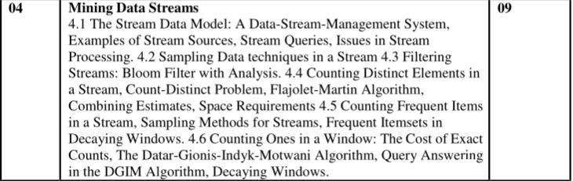
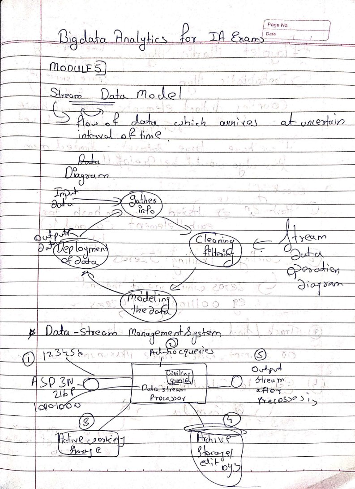
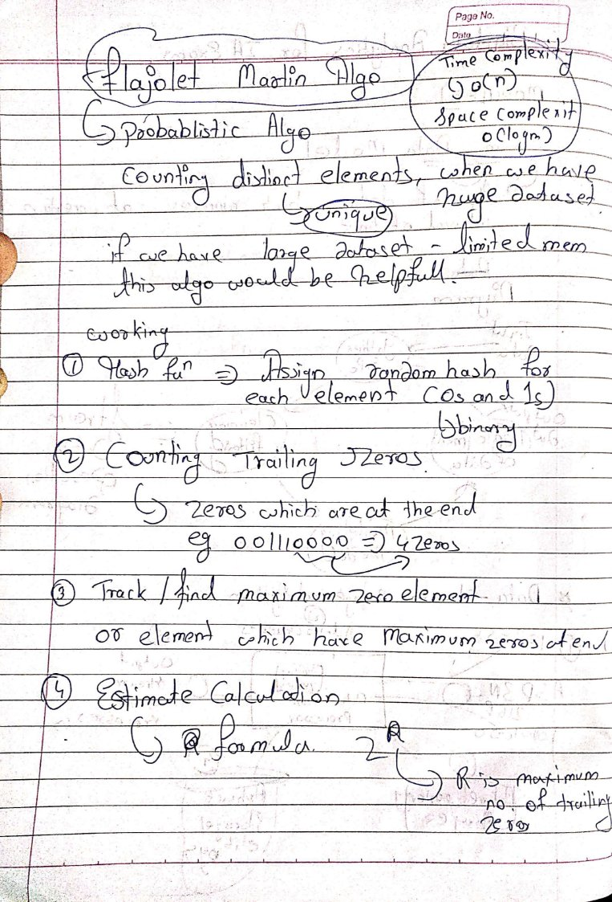
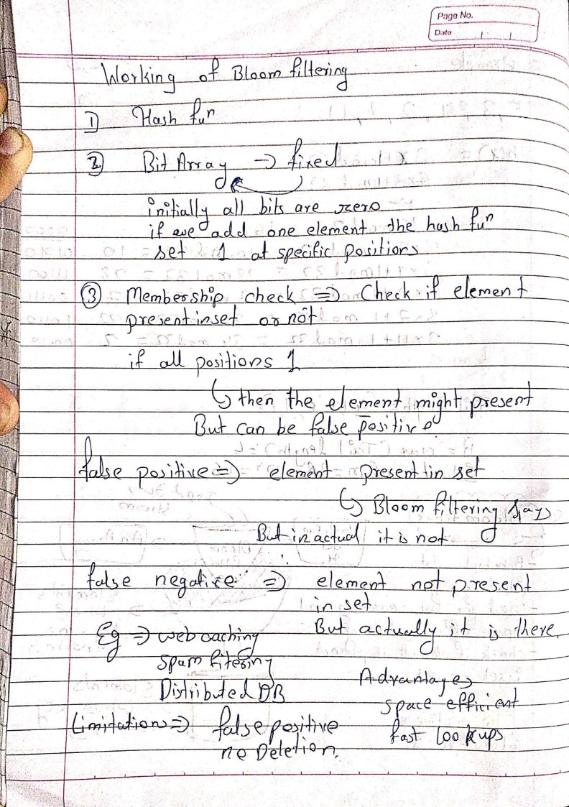
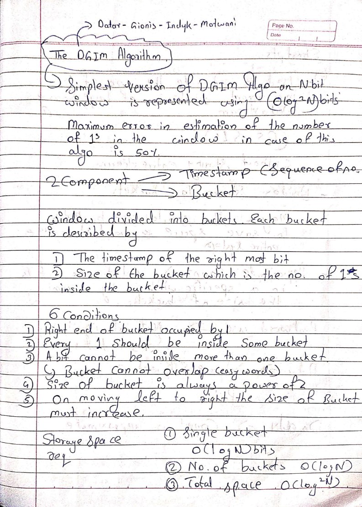
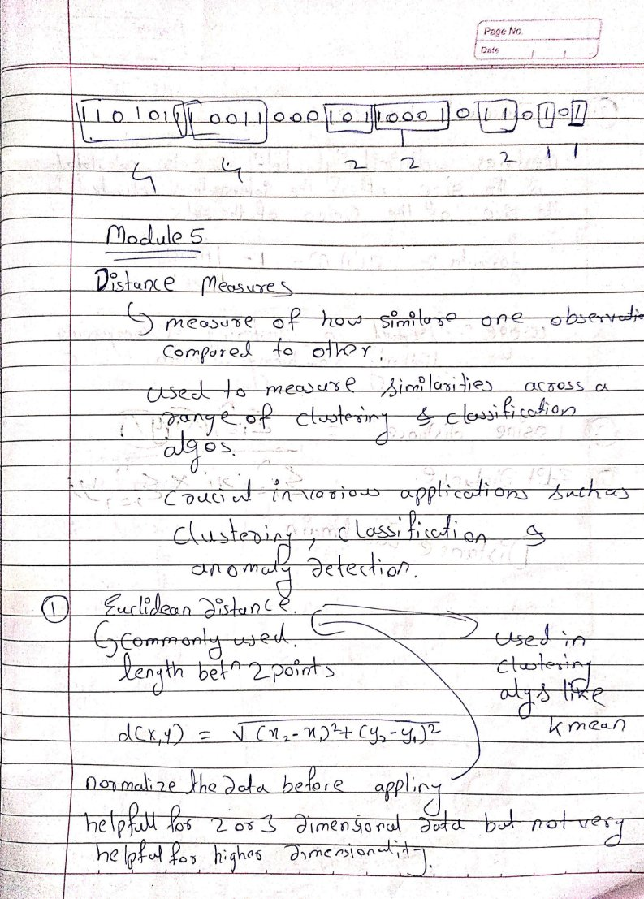
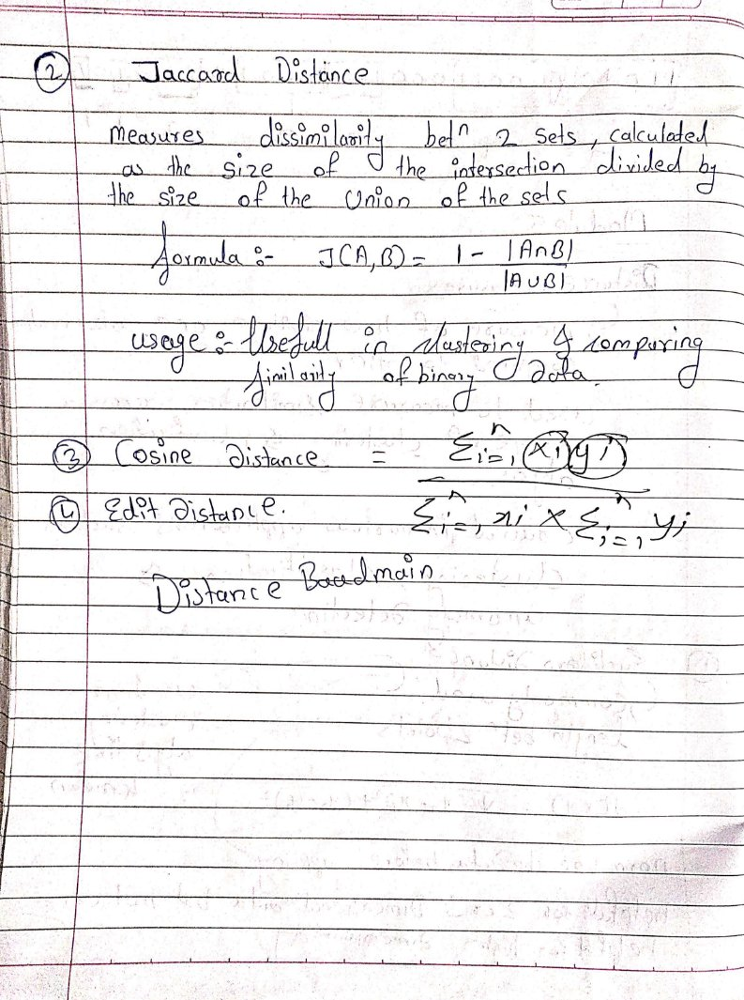
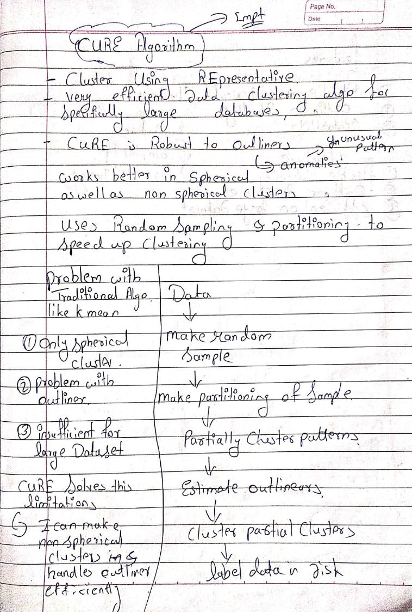
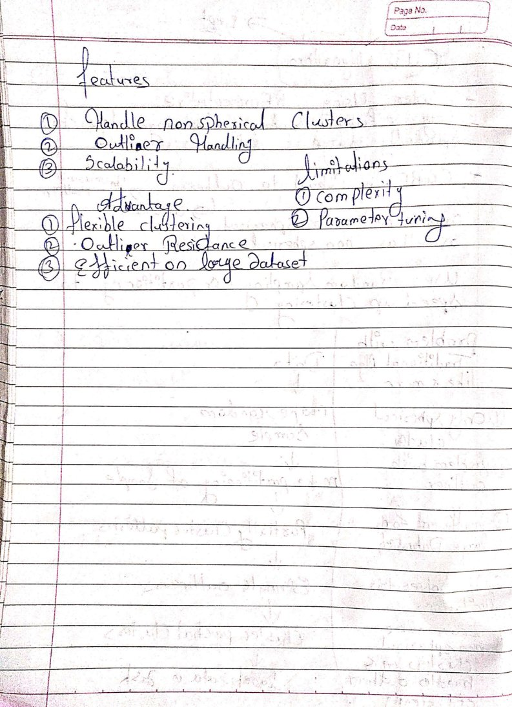

### Syllabus

### Stream data model 

The stream data model in big data analytics is a processing model designed to ==handle data that is continuously generated in real-time== by various ==sources== such as ==sensors, social media, transactions, and log files==. This data arrives in an ongoing, unbounded flow rather than being stored in fixed batches. The model enables the analysis, transformation, and storage of data as it streams in, allowing for real-time insights and actions. Here’s an in-depth look at the stream data model and its components, characteristics, and applications:

##### 1. **Characteristics of the Stream Data Model**

- **==Continuous Data Flow==**: ==Data== is ==generated and collected continuously==, often in small, ==high-frequency increments==.
- ==**Low Latency Processing==**: Stream processing is designed for ==near real-time== or real-time data processing, with ==minimal delay between== data generation and analysis.
- **Unbounded Data Sets**: Unlike batch data, which is processed in finite sets, streaming data is unbounded and constantly growing.
- **Time Sensitivity**: The value of data in stream processing often diminishes over time, making timely processing essential.
- ==**Event-Based Processing==**: Stream data typically consists of individual events (e.g., transactions, clicks, sensor readings) that are processed in the order they  are received.

##### 2. **Components of the Stream Data Model**

- **Data Sources**: The sources generating data, such as IoT sensors, social media platforms, application logs, and financial transactions.
- **Stream Ingestion**: Tools or platforms that capture and ingest streaming data. Examples include **Apache Kafka**, **Amazon Kinesis**, and **Apache Pulsar**.
- **Stream Processing Engine**: This engine processes data in real-time, often performing transformations, aggregations, and computations. Common stream processing frameworks include **Apache Flink**, **Apache Spark Streaming**, and **Apache Storm**.
- **Data Storage**: Storage systems optimized for stream data, often involving both temporary storage (for intermediate results) and long-term storage (for historical analysis). Examples include **NoSQL databases** (e.g., Cassandra, HBase) and distributed file systems (e.g., HDFS, S3).
- **Output / Action**: After processing, results are directed to target systems for real-time dashboards, alerts, or storage for further analysis. Results can also trigger automated actions or updates in other systems.
##### 3. **Stream Processing Models**

- **Real-Time Analytics**: Processes data as it arrives, providing immediate insights and actions. For example, identifying fraudulent transactions as they happen.
- **==Window-Based Processing==**: Uses time or event count windows to group and process data streams in manageable chunks. Common window types include:
    - **Tumbling Window**: Fixed-size, non-overlapping windows (e.g., 5-minute windows).
    - **==Sliding Window==**: Fixed-size, overlapping windows, allowing for more granular analysis.
    - **Session Window**: Windows based on periods of activity, separated by periods of inactivity.
- **Complex Event Processing (CEP)**: Detects patterns and correlations across multiple streams and time intervals, often used for anomaly detection and predictive analytics.
##### 4. **Applications of the Stream Data Model in Big Data Analytics**

The stream data model is applied across industries for real-time decision-making and responsive actions, including:

- **==Financial Services==**: Fraud detection, high-frequency trading, real-time risk assessment.
- ==**IoT and Sensor Analytics==**: Monitoring and analyzing data from connected devices, such as temperature readings, GPS coordinates, and machine telemetry, to detect anomalies and trigger alerts.
- **==Social Media and Customer Sentiment Analysis==**: Monitoring user activity and sentiment on platforms like Twitter and Facebook to identify trends, public sentiment, or breaking news.
- ==**E-commerce and Retail==**: Real-time recommendation engines, dynamic pricing, and personalized offers based on customer behavior.
- **==Operations and System Monitoring==**: Real-time monitoring of logs and system metrics for IT infrastructure and network performance.
##### 5. **Advantages of the Stream Data Model**

- **Low Latency**: Enables instant insights and actions, crucial for applications like fraud detection and operational monitoring.
- **Scalability**: Stream processing systems can handle large volumes of data, often using distributed systems to achieve scalability.
- **Resource Efficiency**: Stream processing avoids storing all incoming data, focusing on immediate analysis and reducing storage costs.
- **Adaptability**: Designed to handle various types of data formats and sources, from structured logs to unstructured social media data.

##### 6. **Challenges in the Stream Data Model**

- **Data Consistency**: Ensuring consistent processing of out-of-order or delayed events can be challenging.
- **Fault Tolerance**: Real-time systems must be resilient to failures, which often requires complex, distributed recovery mechanisms.
- **Scalability and Performance**: Managing the high throughput and velocity of data streams requires resources, careful system design, and potentially distributed computing.
- **Window Management**: Determining the appropriate window size for analysis can impact performance and accuracy.

##### 7. **Tools and Technologies for Stream Processing**

Several tools and technologies support the stream data model, each optimized for specific use cases:

- **Message Brokers for Data Ingestion**: Apache Kafka, Amazon Kinesis, RabbitMQ
- **Stream Processing Frameworks**: Apache Flink (for low-latency processing), Apache Spark Streaming (integrated with Spark), Apache Storm (for complex event processing), and Google Dataflow (for cloud-native stream processing).
- **Visualization and Alerting**: Tools like Grafana and Kibana are often integrated with stream processing pipelines to visualize and alert based on real-time metrics and insights.

### Data Stream Management System

A **Data Stream Management System (DSMS)** is a ==specialized system for managing and processing continuous data streams in real time==. Unlike ==traditional databases, which store static data and respond to periodic queries==, a DSMS handles transient data that arrives in a ==continuous, unbounded flow==. This makes it ideal for applications that need to ==process and analyze high-velocity data==, such as IoT applications, financial trading systems, network monitoring, and real-time analytics.

##### 1. **Core Functions and Purpose of a DSMS**

- **Continuous Query Processing**: DSMSs support continuous queries, which are persistent queries that automatically run as data flows through the system, providing updated results in real-time.
- **Real-Time Processing**: DSMSs process data with minimal delay to deliver insights almost instantaneously, making them suitable for time-sensitive applications.
- **Transient Data**: Data in a DSMS is often processed on-the-fly, meaning it may not be permanently stored. Instead, it is analyzed, acted upon, or discarded after processing.
- **Event-Based Architecture**: DSMSs operate in an event-driven manner, where each data point or event triggers processing steps according to predefined rules or queries.

##### 2. **Architecture of a DSMS**

A typical DSMS architecture includes the following components:

- **Data Sources**: The input streams generated by various sources, such as IoT devices, sensors, social media feeds, application logs, and transaction records.
- **Data Stream Ingestion Layer**: A layer responsible for capturing and ingesting data streams. This often includes message brokers like **Apache Kafka** or **Amazon Kinesis** that handle high-throughput data ingestion.
- **Stream Processing Engine**: The ==core component== that processes data streams in real time. It ==executes continuous queries==, performs computations, applies transformations, and supports operations like filtering, aggregation, and joining.
- **Query Processor**: ==Manages and optimizes the execution of continuous queries==. The query processor interprets incoming data against active queries and outputs the relevant results.
- **Windowing Mechanism**: Since streaming data is unbounded, DSMSs use windowing to segment data into manageable chunks (e.g., time-based, count-based, or session-based windows) for more efficient processing.
- **Storage (Optional)**: Some DSMSs incorporate temporary or permanent storage for buffering, logging, or archiving, allowing historical analysis or hybrid processing of historical and real-time data.
- **Output and Action Layer**: Sends the results of stream processing to other systems, dashboards, or applications, triggering actions, alerts, or responses.

##### 3. **Key Features of a DSMS**

- **Support for Continuous Queries**: Continuous queries allow users to define processing rules that execute as new data flows in, unlike traditional SQL, which operates on static datasets.
- **Windowing Support**: Allows partitioning of streams into smaller subsets based on time, count, or events, enabling aggregation and analysis of data in near-real-time segments.
- **Scalability**: DSMSs are designed to scale horizontally, processing large volumes of data across distributed nodes to handle high-velocity data streams.
- **Fault Tolerance**: Ensures that data processing is resilient to failures, using techniques like checkpointing and data replication for reliable operation.
- **Low Latency**: DSMSs are optimized for minimal processing delay to support applications where real-time decisions are critical.

##### 4. **Processing Models in a DSMS**

DSMSs commonly use a few distinct processing models to handle streaming data:

- **Stateless Processing**: Each event is processed independently without reference to past data. This model is fast and resource-efficient, suitable for filtering, transformations, and basic event processing.
- **Stateful Processing**: Requires maintaining a state across events, such as tracking counts, calculating averages, or maintaining session information. Stateful processing is essential for operations like running totals or detecting patterns over time.
- **Window-Based Processing**: Data streams are divided into "windows" to aggregate data over fixed intervals, such as every minute or hour, or based on a count of events.
- **Complex Event Processing (CEP)**: This advanced model identifies patterns, correlations, or conditions across multiple streams or time intervals, such as detecting fraud by recognizing unusual transaction patterns across accounts.

##### 5. **Examples of DSMS Platforms**

- **Apache Flink**: A stream-processing framework with a powerful stateful and low-latency engine. Flink supports complex event processing, windowing, and fault tolerance, making it suitable for large-scale real-time analytics.
- **Apache Spark Streaming**: An extension of Apache Spark that performs stream processing in micro-batches. It offers scalability and integrates with the broader Spark ecosystem for hybrid batch-stream processing.
- **Apache Storm**: A real-time stream processing system that provides reliable, distributed processing and is often used for low-latency processing needs.
- **Amazon Kinesis Data Analytics**: A managed service on AWS that enables real-time analytics on streaming data, integrating with Kinesis Data Streams and other AWS services.
- **Google Dataflow**: A fully managed stream processing service that provides real-time data processing capabilities, based on Apache Beam, for both batch and streaming data.

##### 6. **Use Cases of DSMS**

The DSMS is useful in any scenario where immediate action on data is necessary. Key use cases include:

- **Real-Time Fraud Detection**: Financial institutions use DSMSs to analyze transaction data streams for unusual patterns and detect fraud in real time.
- **IoT and Sensor Data Monitoring**: DSMSs process data from IoT devices and sensors to monitor environments, machines, or infrastructure, enabling predictive maintenance and quick responses to anomalies.
- **Network Monitoring and Security**: DSMSs are deployed to monitor network traffic, detect intrusions, and respond to security threats based on patterns in real-time.
- **Personalized Recommendations**: E-commerce platforms use streaming data from user behavior to update recommendations dynamically, providing users with up-to-date, relevant suggestions.
- **Social Media Analytics**: Real-time analysis of social media streams to detect trends, measure sentiment, and track public reactions to events.

##### 7. **Benefits of Using a DSMS**

- **Real-Time Decision Making**: By providing immediate insights, DSMSs enable quick, informed actions in critical applications.
- **Efficient Processing of High-Velocity Data**: DSMSs are optimized to handle high-throughput data streams, avoiding the need to store and batch-process large volumes of data.
- **Scalability and Flexibility**: DSMSs can scale horizontally, often distributed across multiple nodes, to manage large and variable data volumes effectively.
- **Cost Efficiency**: Processing data as it arrives reduces the need for long-term storage and allows organizations to manage only the essential data they need.

##### 8. **Challenges of DSMS**

- **Complexity in Managing State**: For stateful applications, ensuring accurate state management, especially in the event of node failures or restarts, can be challenging.
- **Latency Sensitivity**: Maintaining low latency while ensuring reliability and scalability is complex, especially in distributed environments.
- **Scalability and Resource Usage**: As data volumes grow, scaling a DSMS to meet performance requirements without excessive resource use requires careful architecture and tuning.
- **Data Consistency**: Ensuring consistency and reliability when processing high-velocity, distributed data streams can be technically challenging.

### Difference between DSMS and DBMS

| **Data Stream Management System (DSMS)**                      | **Database Management System (DBMS)**                               |
| ------------------------------------------------------------- | ------------------------------------------------------------------- |
| Handles ==continuous==, ==unbounded== data streams            | Manages ==static==, ==finite==, and ==persistent== data             |
| Often transient (data may not be ==stored permanently==)      | Persistent storage with structured tables or collections            |
| ==Real-time== or near real-time processing                    | ==Batch processing== or on-demand querying                          |
| ==Continuous queries== that process incoming data instantly   | ==Ad-hoc or scheduled queries== on stored data                      |
| Designed for ==low-latency, real-time analytics==             | Typically ==higher latency compared== to DSMS                       |
| ==Event-driven==; processes data as it arrives                | ==Query-driven==; data is accessed when requested by a user         |
| ==Stateful== processing with complex event handling           | Primarily uses ==CRUD operations== for state management             |
| ==Flexible schema;== often schema-less or semi-structured     | ==Structured schema==, usually predefined (e.g., tables, columns)   |
| Real-time analytics, fraud detection, IoT monitoring          | Transactional systems, long-term storage, historical analysis       |
| Apache Flink, Apache Kafka Streams, Amazon Kinesis            | MySQL, PostgreSQL, Oracle, MongoDB                                  |
| Typically ==horizontal scaling==, suited for distributed data | Both ==vertical and horizontal scaling==, often within ==clusters== |
| Supports ==time-based, count-based, and session windows==     | No ==native support for windowing in traditional DBMSs==            |
| Provides ==recovery and checkpointing== for stream processing | ==Ensures ACID compliance== and data integrity                      |
| Eventual ==consistency often prioritized==                    | ==Strong consistency== (ACID properties in relational DBMSs)        |
| Processes data on-the-fly, reducing storage requirements      | Requires disk space for all stored data, increasing resource use    |
### Stream Queries

**Stream Queries** are a type of query specifically ==designed to process and analyze continuous, real-time data streams rather than static datasets==. In a data stream management system (DSMS) or a real-time data processing framework, stream queries run continuously, evaluating incoming data as it arrives. This is different from traditional database queries, which operate on finite datasets and return a single result set upon completion.

#### Key Characteristics of Stream Queries

1. **Continuous Execution**: Stream queries are ==persistent and execute continuously==, producing updated results in real time as new data flows in.
    
2. **Real-Time Results**: Stream queries are optimized to provide results with minimal latency, enabling real-time insights and actions.
    
3. **Event-Driven Processing**: Each data point (or event) triggers an evaluation of the query. Stream queries can act on each event or group events based on conditions such as time windows.
    
4. **Windowing**: Since stream data is unbounded, stream queries use windowing mechanisms (time-based, count-based, or session-based windows) to break data into finite chunks for easier processing and analysis.
    
5. **Stateless and Stateful Processing**: Stream queries may be stateless, processing each event independently, or stateful, where they keep track of information across events (e.g., counting occurrences, calculating averages over time).

#### Types of Stream Queries

1. **Filtering**: Extracts specific events based on conditions. For instance, monitoring all user login events where login attempts exceed a threshold.
    
2. **Aggregation**: Calculates metrics such as count, sum, average, or max over a sliding or tumbling window. Useful for metrics like "average temperature over the past 5 minutes."
    
3. **Joining Streams**: Combines data from multiple streams, often with a time constraint, to create relationships between data points from different sources.
    
4. **Pattern Matching**: Identifies complex patterns across events, commonly used in fraud detection or anomaly detection.

#### Use Cases of Stream Queries

- **Real-Time Analytics**: Monitoring business metrics like order volume, active users, or website traffic.
- **Fraud Detection**: Identifying unusual transaction patterns or login attempts by continuously evaluating transaction data streams.
- **IoT Monitoring**: Analyzing sensor data for threshold breaches or anomalies in environmental conditions.
- **Customer Engagement**: Providing dynamic, personalized content and recommendations based on real-time user behavior.
#### Benefits of Stream Queries

- **Immediate Insights**: Enable organizations to take real-time actions based on live data.
- **Scalability**: Stream queries scale horizontally, processing data as it arrives.
- **Reduced Data Storage**: They often reduce the need for extensive storage by processing data on-the-fly and only storing results or significant events.

### Sampling techniques for efficient stream processing

##### 1. Sliding Window

This is the simplest and most straightforward method. A first-in, first-out (FIFO) queue with size _n_ and a skip/sub-sampling factor _k ≥1_ is maintained. In addition to that, a stride factor s ≥ 1 describes by how many time-steps the window is shifted before analyzing it.

Sliding Window (Image by Author).

**Advantage**

- simple to implement
- deterministic — reservoir can be filled very fast from the beginning

**Drawbacks**

- the time history represented by the reservoir _R_ is short; long-term concept drifts cannot be detected easily — outliers can create noisy analyses

##### 2. Unbiased Reservoir Sampling

A reservoir _R_ is maintained such that at time _t > n_ the probability of accepting point _x(t)_ in the reservoir is equal to _n/t_.

The algorithm [1] is as follows:

- Fill the reservoir _R_ with the first _n_ points of the stream.
- At time _t > n_ replace a randomly chosen (equal probability) entry in the reservoir _R_ with acceptance probability _n/t_.

This leads to a reservoir _R(t)_ such that each point _x(1)…x(t)_ is contained in _R(t)_ with equal property _n/t_.

**Advantages**

- The reservoir contains data points from all history of the stream with equal probability.
- Very simple implementation; adding a point requires only O(1)

**Drawbacks**

- A concept drift cannot be compensated; the oldest data point x(1) is equal important in this sampling technique as the latest data point x(t).

##### 3. Biased Reservoir Sampling

In biased reservoir sampling Alg. 3.1, [2] the probability of a data point x(t) being in the reservoir is a decreasing function of its lingering time within R. So the probability of finding points of the sooner history in R is high. Very old data points will be in R with very low probability.

Illustration of the Biased Reservoir Sampling (Image by Author)

The probability that point x(r) is contained in R(t) equals to

The example from the `github.com\andremueller\goservoir` package shows the lingering time of a stack of unbiased reservoir samplers.

Reservoir Sampling Chain output (Image by Author)

**Advantages:**

- O(1) algorithm for adding a new data point.
- Slowly moving concept drifts can be compensated.
- An adjustable forgetting factor can be tuned for the application of interest.

**Drawbacks:**

- It is a randomized technique. So the algorithm is non-deterministic. However, the variance might be estimated by running an ensemble of independent reservoirs [3]

##### 4. Histograms

A histogram is maintained while observing the data stream. Hereto, data points are sorted into intervals/buckets

If the useful range of the observed values is known in advance, a simple vector with counts and breakpoints could do the job.

V-optimal histograms tries to minimize the variance within each histogram bucket. [4] proposes an algorithm for efficiently maintaining an approximate V-optimum histogram from a data stream. This is of relevance for interval data, such as a time-series of temperature values; i.e., absolute value and distance between values have a meaning.

