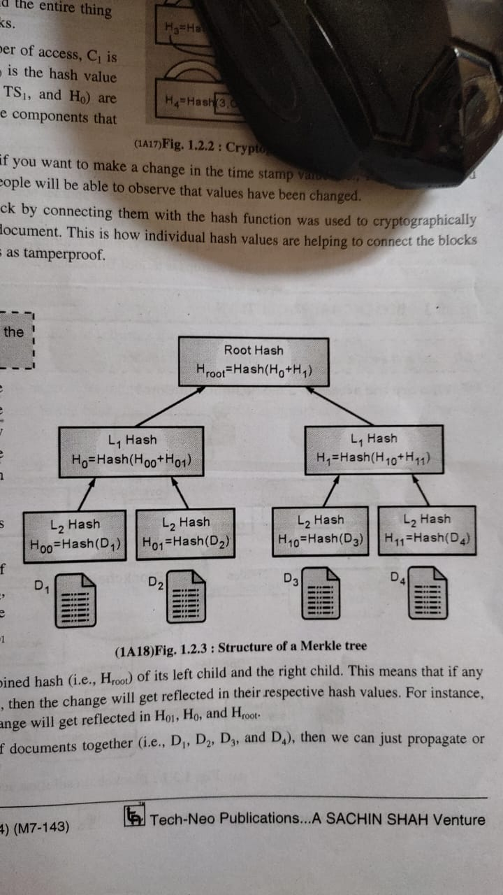
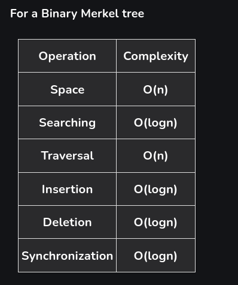

https://www.geeksforgeeks.org/introduction-to-merkle-tree/

==hash tree , data structure== used in blockchain and other cryptographic systems to efficiently and securely verify large amounts of data.

organizes data into a tree-like structure, where each **leaf node** contains a cryptographic hash of data, and each **non-leaf node** is a hash of its child nodes. The root of the tree, called the **Merkle Root**, summarizes all the data in the tree.

---

---
### **Why Use a Merkle Tree in Blockchain?**

1. **Efficient Verification**: Allows quick verification of whether a specific piece of data (like a transaction) belongs to a block, without requiring the entire dataset.
2. **Data Integrity**: Any change in data at any level propagates to the root, ensuring tamper-proof data.
3. **Reduced Storage**: Only the root hash needs to be stored or verified instead of the entire dataset.
---

### **Merkle Tree Structure**

A Merkle Tree is built by repeatedly hashing pairs of data until a single hash remains, which is the **Merkle Root**.

1. **Leaf Nodes**:
    - The bottom-most layer.
    - Each leaf node represents the cryptographic hash of a piece of data (e.g., a transaction in a blockchain).
2. **Intermediate Nodes**:
    - Above the leaf nodes.
    - Each node is a hash of its two child nodes.
3. **Merkle Root**:
    - The top-most node in the tree.
    - Represents the combined hash of all the data in the tree.
---
### **Advantages of Merkle Trees**

1. **Data Integrity**:
    - If any data (transaction) is tampered with, it alters the Merkle Root, making it easy to detect.
2. **Efficient Verification**:
    - Verifying a transaction requires only a few hashes (logarithmic in size), even if the dataset is huge.
3. **Scalability**:
    - Works well with large datasets, as only the Merkle Root is stored or transmitted.
4. **Bandwidth Saving**:
    - Reduces the need to send all transactions for verification, just the proof path.

---

### **Applications of Merkle Trees in Blockchain**

1. **Bitcoin**:
    - Bitcoin uses Merkle Trees to store transactions in a block.
    - The Merkle Root is stored in the block header and serves as a compact representation of all transactions in the block.
2. **Ethereum**:
    - Ethereum uses a more advanced structure called **Merkle Patricia Trie** to manage state data (e.g., account balances, smart contracts).
3. **Efficient Light Nodes**:
    - Simplified Payment Verification (SPV) wallets use Merkle Trees to verify transactions without downloading the entire blockchain.
4. **Proofs and Audits**:
    - Used in applications like supply chain auditing or secure data sharing.

---

### **Summary**

A **Merkle Tree** is a cryptographic data structure that organizes data into a hierarchical tree, allowing efficient and secure verification of data integrity. It is foundational to blockchain because it enables fast verification, scalability, and tamper detection, making it ideal for handling large amounts of transaction data.

