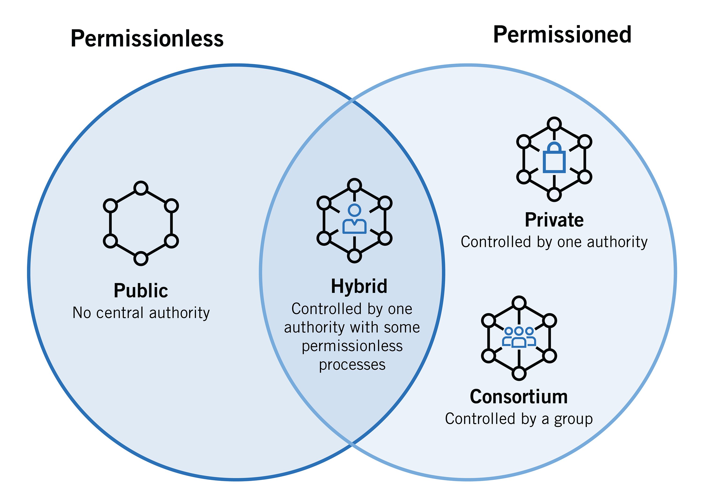

---

---

---

### **Private Blockchain System**

A **Private Blockchain** is a type of blockchain where access to the network is ==restricted and controlled==. Unlike public blockchains like Bitcoin or Ethereum, which are open for anyone to join and participate, private blockchains operate in a closed ecosystem, typically managed by a single organization or a consortium.

---

### **Key Characteristics of a Private Blockchain**

1. **Permissioned Access**:
    - Only authorized participants can join and interact with the network.
    - Nodes are carefully selected and verified.
2. **Centralized Control**:
    - A central authority or consortium governs the network, deciding who has access and what rights each participant holds.
3. **Customizable Consensus Mechanisms**:
    - Unlike proof-of-work (used in public blockchains), private blockchains often use faster, more efficient consensus algorithms like **Raft**, **PBFT (Practical Byzantine Fault Tolerance)**, or **Proof of Authority (PoA)**.
4. **High Performance**:
    - Since the number of participants is limited, transactions are processed faster, with higher throughput and lower latency.
5. **Privacy**:
    - Transactions and data are visible only to authorized participants, ensuring confidentiality.
6. **Lower Energy Consumption**:
    
    - Private blockchains do not rely on energy-intensive mining processes like proof-of-work.

---

### **How Private Blockchains Work**

1. **Network Setup**:
    - The organization or consortium establishes a network and defines rules for participation.
2. **Permissioning**:
    - Only authorized participants (nodes) are allowed to join. These nodes often represent trusted entities, such as partner organizations.
3. **Consensus Mechanism**:
    - Nodes validate transactions using a lightweight consensus mechanism suitable for a small, trusted network.
4. **Data Sharing**:
    - Data is shared and updated across the network, but access is restricted to authorized participants.

---

### **Use Cases of Private Blockchains**

1. **Supply Chain Management**:
    - Track goods and ensure transparency among authorized participants.
    - Example: **IBM Food Trust** for tracking food safety.
2. **Financial Services**:
    - Facilitate faster and more secure interbank transactions.
    - Example: **Quorum** (used by JPMorgan Chase).
3. **Healthcare**:
    - Securely store and share medical records among approved entities.
    - Example: **MedicalChain**.
4. **Enterprise Data Management**:
    - Manage sensitive internal data securely across departments or subsidiaries.
5. **Identity Management**:
    - Store and verify user identities within a trusted network.
6. **Government and Voting**:
    - Enable transparent but secure voting and record management.

---

### **Advantages of Private Blockchains**

1. **Controlled Environment**:
    - Access is limited to trusted participants, reducing risks associated with malicious users.
2. **Enhanced Privacy**:
    - Sensitive information is only visible to authorized entities.
3. **Faster Transactions**:
    - Limited participants and lightweight consensus lead to quicker processing times.
4. **Regulatory Compliance**:
    - Easier to adhere to regulations as the network is controlled.
5. **Customizability**:
    - Can be tailored to meet the specific needs of an organization or industry.

---

### **Challenges of Private Blockchains**

1. **Centralization**:
    - Limited decentralization may reduce trust compared to public blockchains.
2. **Reduced Transparency**:
    - Since access is restricted, it lacks the transparency of public blockchains.
3. **Single Point of Failure**:
    - A central authority could become a bottleneck or a target for attacks.
4. **Limited Use Cases**:
    - Not suitable for applications requiring high decentralization or public trust.
5. **Onboarding Costs**:
    - Requires initial investment to onboard and maintain participants and infrastructure.

---

### **Comparison: Public vs Private Blockchains**

|**Aspect**|**Public Blockchain**|**Private Blockchain**|
|---|---|---|
|**Access**|Open to anyone.|Restricted to authorized participants.|
|**Governance**|Decentralized (managed by the community).|Centralized (managed by an organization).|
|**Consensus**|Energy-intensive (e.g., PoW, PoS).|Lightweight (e.g., PBFT, PoA).|
|**Performance**|Slower due to global participation.|Faster due to limited participants.|
|**Transparency**|Fully transparent and public.|Partially transparent, limited to members.|
|**Security**|High security via decentralization.|Relatively secure but depends on governance.|
|**Energy Usage**|High (e.g., mining in PoW).|Low (efficient consensus mechanisms).|

---

### **Examples of Private Blockchain Platforms**

1. **Hyperledger Fabric**:
    - A modular blockchain framework designed for enterprise use cases.
    - Supports permissioned access and private transactions.
2. **Quorum**:
    - Ethereum-based private blockchain developed by JPMorgan Chase.
    - Designed for financial services and enterprise applications.
3. **Corda**:
    - A blockchain platform focused on enterprise transactions, particularly in the finance sector.
4. **Ripple**:
    - Primarily used for real-time cross-border payments.
5. **Multichain**:
    - Provides a private blockchain platform for enterprise-grade applications.

---

### **When to Use a Private Blockchain**

- Sensitive data or processes that need confidentiality.
- Applications where participants are known and trusted.
- Situations requiring regulatory compliance.
- Use cases demanding high transaction speed and efficiency.

---

### **Conclusion**

Private blockchains provide a secure, efficient, and customizable solution for organizations looking to implement blockchain technology in controlled environments. While they trade off some transparency and decentralization, they excel in privacy, performance, and compliance, making them ideal for enterprise use cases.