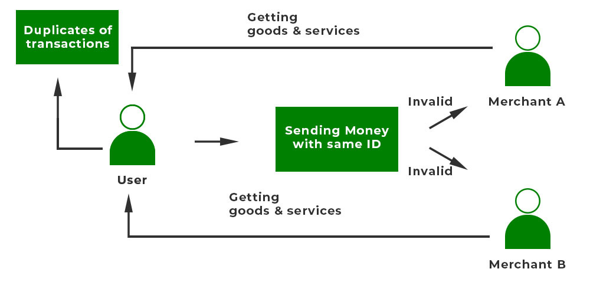

# [[Hinglish Double spending]]

==Double-spending is the fraudulent act of spending the same digital currency more than once==. In a decentralized blockchain network, such as Bitcoin, where there is no central authority to validate transactions, the **Proof of Work (PoW)** consensus mechanism plays a crucial role in preventing double-spending. Here’s how it works:

---

### **1. Overview of the Problem**

In traditional digital systems, a central authority (like a bank) ensures that the same money isn't spent twice. In blockchain, without a central authority, anyone could try to:

- Broadcast the same transaction to multiple nodes.
- Attempt to spend the same funds in multiple transactions.

Without a solution, this would destroy trust in the system.

---

### **2. Proof of Work Mechanism**

PoW ==addresses the issue of double-spending by enforcing strict rules for adding transactions to the blockchain and making it computationally expensive to cheat==. The steps below illustrate how PoW prevents double-spending:

#### **Step 1: Transaction Broadcast**

- Users broadcast their transactions to the network.
- These transactions include details like sender, receiver, amount, and a digital signature to prove ownership of the funds.

#### **Step 2: Transaction Validation**

- Nodes (computers in the network) verify the transactions by checking:
    1. The sender’s account balance is sufficient.
    2. The digital signature is valid.

#### **Step 3: Block Creation**

- Miners collect valid transactions into a block.
- To add this block to the blockchain, miners must solve a **complex cryptographic puzzle** (the PoW process). This involves finding a hash value (output of a hash function) that meets specific conditions (e.g., starts with a certain number of zeros).

#### **Step 4: Block Addition to the Blockchain**

- The first miner to solve the puzzle broadcasts the solution to the network.
- Other nodes verify:
    - The block’s validity.
    - The accuracy of the miner’s solution.
- Once verified, the block is added to the blockchain.

#### **Step 5: Irreversibility**

- As more blocks are added on top of the newly mined block, it becomes increasingly difficult to alter the block due to the computational effort required to "re-mine" the chain.

---

### **How PoW Prevents Double-Spending**

1. **Timestamped Transactions**
    
    - Transactions are added to blocks in a chronological order. Once a transaction is included in a block, it becomes part of the immutable blockchain history.
2. **Consensus Mechanism**
    
    - Only one valid version of the blockchain can exist, as miners compete to solve the PoW puzzle. The chain with the most computational work (i.e., the longest chain) is considered the valid one. Any attempt to double-spend requires creating an alternative chain, which is computationally infeasible.
3. **High Cost of Fraud**
    
    - To successfully double-spend, an attacker would need to:
        1. Control at least **51% of the network’s total mining power** (known as a 51% attack).
        2. Re-mine the altered block and all subsequent blocks faster than the rest of the network.
    - The cost of acquiring this much computational power and energy makes double-spending impractical.
4. **Network Validation**
    
    - If a malicious actor tries to double-spend by submitting two conflicting transactions:
        - Only one of them will be included in a block.
        - The other transaction will be invalidated as it conflicts with the already confirmed transaction.
5. **Immutability**
    
    - Once a block containing a transaction is added to the blockchain and several more blocks are built on top of it, reversing the transaction becomes nearly impossible. The deeper a block is in the chain, the more secure it is against tampering.

---

### **Example of Double-Spending Prevention in PoW**

- **Scenario**: A user (Attacker A) has 1 Bitcoin (BTC) and tries to spend it twice:
    1. **Transaction 1**: A sends 1 BTC to Vendor X.
    2. **Transaction 2**: A sends 1 BTC to Vendor Y (double-spending attempt).

#### What Happens:

1. Both transactions are broadcast to the network.
2. Miners verify the transactions and include only one (e.g., the first one) in the next block.
3. The block containing Transaction 1 is added to the blockchain after a miner solves the PoW puzzle.
4. The network accepts Transaction 1 as valid, while Transaction 2 is rejected because:
    - The funds were already spent in Transaction 1.
    - The blockchain reflects that A no longer has the 1 BTC after Transaction 1.

---

### **Key Strengths of PoW Against Double-Spending**

1. **Deterministic Resolution**:
    - PoW ensures that only one version of the blockchain is valid at any given time, resolving conflicts automatically.
2. **Economic Incentives**:
    - Miners are rewarded with cryptocurrency for solving PoW puzzles honestly, giving them no incentive to process fraudulent transactions.
3. **Security Through Computational Difficulty**:
    - The immense computational power required to overwrite blocks makes fraudulent attempts highly expensive and unlikely to succeed.

---

### **Limitations of PoW in Preventing Double-Spending**

1. **51% Attack**:
    - If an attacker controls the majority of mining power, they could potentially reorganize the blockchain and execute double-spending attacks.
2. **Latency**:
    - Transactions may take time to be confirmed (e.g., Bitcoin typically requires 6 confirmations), during which users might worry about double-spending.

---

### **Conclusion**

Proof of Work solves the double-spending problem by making it computationally infeasible to alter the blockchain’s history. Its reliance on economic incentives, decentralization, and cryptographic security ensures that malicious actors cannot easily manipulate the system. This feature is a cornerstone of blockchain’s trustless and secure nature.