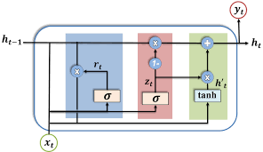

GRU, or ==Gated Recurrent Unit==, is a type of Recurrent Neural Network (RNN) architecture similar to Long Short-Term Memory (LSTM) networks but simpler in structure. It was introduced by Kyunghyun Cho et al. in 2014 as a way to address some of the same issues with standard RNNs (like vanishing gradients) but with a more streamlined design. Here’s a detailed, pointwise breakdown of GRUs:

---

### 1. **Introduction to GRU**
   - **Definition**: GRU is an RNN variant designed to handle long-term dependencies in sequential data by using gating mechanisms, similar to LSTMs, but with fewer parameters.
   - **Motivation**: GRUs were created to simplify the LSTM structure while retaining the ability to learn long-range dependencies, which standard RNNs struggle with.

### 2. **Structure of GRU**
   - Unlike LSTM, which has three gates (forget, input, and output), GRU uses only two gates: **update gate** and **reset gate**. This makes the GRU more computationally efficient and less complex than LSTM.

### 3. **Components of GRU**
   - **Update Gate**: Controls how much of the previous hidden state’s information is retained and how much of the new input is added. It determines the extent to which the unit updates its content.
    $$ z_t = \sigma(W_z \cdot [h_{t-1}, x_t] + b_z)$$
     
   - **Reset Gate**: Controls how much of the previous hidden state should be "forgotten" for computing the new hidden state. When reset is low, it ignores much of the previous hidden state.
					 $r_t = \sigma(W_r \cdot [h_{t-1}, x_t] + b_r)$
 

### 4. **Hidden State Update in GRU**
   - **Candidate Hidden State**: After applying the reset gate, GRU generates a candidate hidden state \( \tilde{h}_t \), which incorporates the new input and controlled parts of the previous hidden state.

     $\tilde{h}_t = \tanh(W_h \cdot [r_t * h_{t-1}, x_t] + b_h)$
     
   - **Final Hidden State**: The final hidden state \( h_t \) is then calculated as a combination of the previous hidden state and the candidate hidden state, using the update gate to decide how much of each should contribute.
    $$ h_t = (1 - z_t) * h_{t-1} + z_t * \tilde{h}_t$$

   - Here, \( z_t \) (update gate) decides how much of the candidate hidden state \( \tilde{h}_t \) should contribute to the final output, and \( (1 - z_t) \) controls how much of the previous hidden state \( h_{t-1} \) should be retained.

### 5. **Advantages of GRU**
   - **Simpler Architecture**: GRU is less complex than LSTM due to fewer gates and parameters, making it faster to train.
   - **Memory Efficiency**: With fewer gates and parameters, GRUs are computationally less expensive, often making them preferable in situations with limited resources.
   - **Comparable Performance**: In many tasks, GRUs perform as well as or even better than LSTMs, especially when long-term dependencies are less critical.

### 6. **Applications of GRU**
   - **Natural Language Processing**: Used in text generation, machine translation, and sentiment analysis.
   - **Speech Recognition**: GRUs are applied to model audio sequences in tasks like speech-to-text conversion.
   - **Time Series Forecasting**: Often used in financial and weather prediction models, where past values influence future predictions.
   - **Video Analysis**: GRUs can be used in processing sequences of video frames for action recognition and video captioning.

### 7. **Comparison with LSTM**
   - **Gating Mechanism**: GRU uses two gates (update and reset) compared to LSTM’s three (forget, input, and output).
   - **Efficiency**: GRU has fewer parameters and is often faster to train.
   - **Memory Retention**: In certain cases, LSTMs are better at capturing long-term dependencies, though GRUs are often sufficient for medium-length dependencies.

### 8. **Challenges of GRU**
   - **Less Control Over Memory**: While simpler, GRUs have slightly less flexibility in controlling memory compared to LSTMs due to fewer gates.
   - **Not Always Optimal for Very Long Sequences**: In cases where very long dependencies are needed, LSTMs might outperform GRUs.

### 9. **Variants of GRU**
   - **Bidirectional GRU**: Processes sequences in both forward and backward directions to capture more context.
   - **Stacked GRU**: Multiple GRU layers are stacked to learn more complex temporal patterns.

### 10. **Conclusion**
   - GRUs provide a streamlined and efficient solution for handling sequential data with medium to long dependencies. Their simpler structure and faster training make them a popular choice for a wide range of sequence-based tasks, and they are particularly useful when computational resources are limited.

---

### **Summary Points for Exam Answer**
- Define **GRU** and its purpose in sequence modeling.
- Explain **update** and **reset gates** and how they control information flow.
- List **advantages** of GRUs over LSTMs.
- Outline **applications** in NLP, time series, and video processing.
- Conclude with its benefits in terms of simplicity and training efficiency.

This format covers the essential points of GRUs for a 10-mark answer.