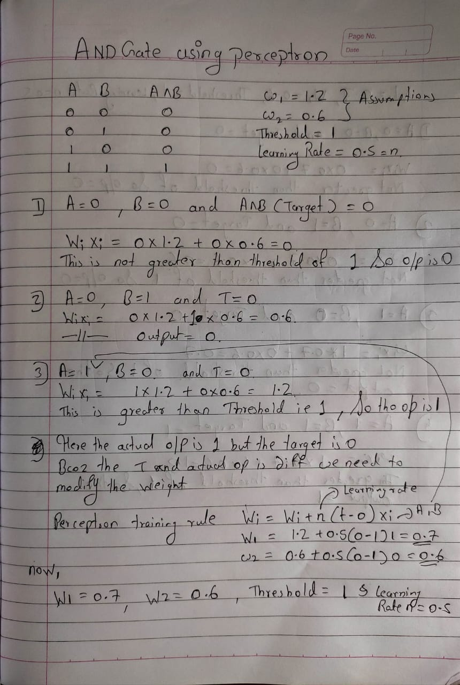
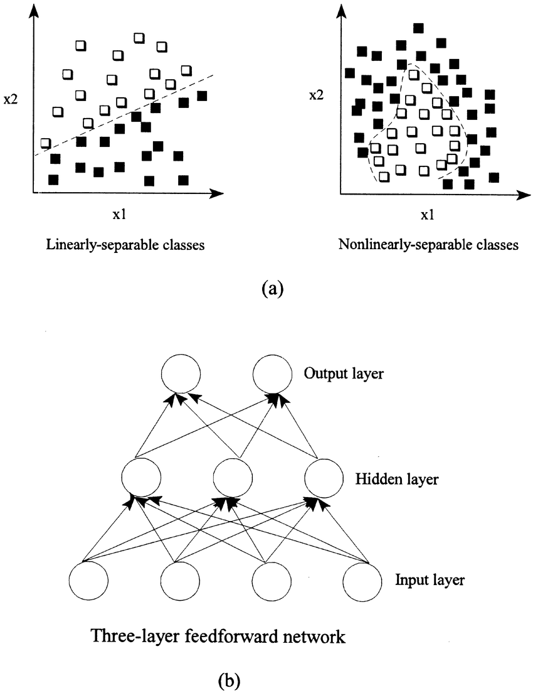
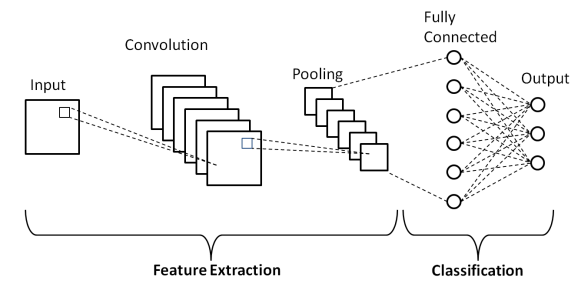

---

## Fundamentals of Deep Learning

- Def: Deep Learning is a subset of machine learning that mimics the workings of the human brain to process data and create patterns for decision-making.
- It uses **neural networks** with multiple layers, hence the term "deep."
#### Neural Networks:

- Neural networks are the building blocks of deep learning.
- **Artificial Neural Networks (ANN)** are inspired by biological neural networks and consist of interconnected layers of neurons (nodes).
- Key components of a neural network include **input layers**, **hidden layers**, and **output layers**
#### Layers in Neural Networks:

- **Input Layer**: The first layer that receives input data (e.g., images, text, numerical values).
- **Hidden Layers**: Intermediate layers between input and output layers, where complex computations and transformations happen. Deep networks typically have multiple hidden layers.
- **Output Layer**: Produces the final output (e.g., classification label, predicted value).
#### **Neurons (Nodes)**:

- **Neuron**: The basic unit in a neural network, which computes the weighted sum of inputs, adds a bias term, and passes it through an activation function.
- Each neuron receives input from the previous layer, processes it, and sends output to the next layer.
#### Weights and Biases:

- **Weights**: The strength of the connection between neurons; these are learned during training.
- **Bias**: A constant added to the weighted sum, allowing the model to fit the data more flexibly.

#Activation function

- Add **non-linearity** to the neural network, enabling it to learn complex patterns.
- Common activation functions:
    - **ReLU (Rectified Linear Unit)**: f(x)=max(0,x)f(x) = max(0, x)f(x)=max(0,x), used to prevent saturation in deep networks.
    - **Sigmoid**: Squashes input values between 0 and 1, useful for binary classification.
    - **Tanh**: Squashes input values between -1 and 1.
    - **Softmax**: Normalizes output into a probability distribution, used in multi-class classification.

#### Feedforward Process:

- In a **feedforward neural network**, data moves forward from the input layer through hidden layers to the output layer.
- Each layer transforms the input data using weights, biases, and activation functions.
#### **Loss Function (Cost Function)**:

- Measures the difference between the predicted output and the actual target.
- Common loss functions:
    - **Mean Squared Error (MSE)**: Used for regression tasks.
    - **Cross-Entropy Loss**: Used for classification tasks.
- The goal is to minimize the loss during training.

#### **Backpropagation**:

- A method used to update the weights in the network to minimize the loss.
- Involves two steps:
    1. **Forward Pass**: Compute the output and loss for given input.
    2. **Backward Pass**: Compute the gradient of the loss with respect to each weight using the chain rule, and adjust the weights.

#### **Optimization Algorithms**:

- These algorithms adjust the weights and biases to minimize the loss.
- Common optimizers:
    - **Stochastic Gradient Descent (SGD)**: Iteratively updates weights by calculating gradients of the loss function.
    - **Adam**: Adaptive optimization algorithm that uses running averages of gradients and squared gradients, typically faster than SGD.

#### Epochs, Batch Size, and Iterations:

- **Epoch**: One complete pass of the entire training dataset through the network.
- **Batch Size**: The number of training examples processed before the model's internal parameters are updated.
- **Iteration**: A single update of the model's parameters, often happening after processing one batch.

#### Regularization Techniques:

- Used to prevent **overfitting** by penalizing overly complex models.
- Common techniques:
    - **L2 Regularization (Ridge)**: Adds a penalty proportional to the square of the weights.
    - **Dropout**: Randomly drops neurons during training to force the network to learn more robust features.
    - **Early Stopping**: Stops training when performance on the validation set starts degrading.

#### Convolutional Neural Networks (CNN):

- Specialized for processing **grid-like data** such as images.
- Key components:
    - **Convolutional Layers**: Extract spatial features using filters.
    - **Pooling Layers**: Reduce the spatial dimensions of the data to prevent overfitting and reduce computation.
    - **Fully Connected Layers**: The final layers that aggregate the features and produce the output.

#### Recurrent Neural Networks (RNN)**:

- Designed for **sequential data**, such as time series, text, or speech.
- They maintain a memory of previous inputs, allowing them to capture temporal dependencies.
- Variants:
    - **LSTM (Long Short-Term Memory)**: Tackles the issue of short-term memory in traditional RNNs, effectively learning long-term dependencies.
    - **GRU (Gated Recurrent Unit)**: A simplified version of LSTM with fewer parameters.

#### Autoencoders:

- A type of unsupervised neural network used for **dimensionality reduction** or **feature learning**.
- It consists of an **encoder** that compresses the input into a lower-dimensional representation and a **decoder** that reconstructs the original input.

#### Generative Models:

- These models generate new data instances.
- Examples:
    - **GANs (Generative Adversarial Networks)**: Two networks (a generator and a discriminator) are trained together; the generator tries to create realistic data while the discriminator tries to distinguish real from fake data.
    - **VAEs (Variational Autoencoders)**: A generative model that learns latent representations of data and generates new instances.

## Multilayered Perceptron ( MLPS )**Generative Models**:

- These models generate new data instances.
- Examples:
    - **GANs (Generative Adversarial Networks)**: Two networks (a generator and a discriminator) are trained together; the generator tries to create realistic data while the discriminator tries to distinguish real from fake data.
    - **VAEs (Variational Autoencoders)**: A generative model that learns latent representations of data and generates new instances.

- A multi-layer perception is a neural network that has multiple layers.
- MLP is a type of [[feedforward]] artificial neural network.
- It consists of at least three layers: an input layer, hidden layer(s), and an output layer.
- To create a neural network we combine neurons together so that the outputs of some neurons are inputs of other neurons.
- It is fully connected dense layers, which transform any input dimension to the desired dimension
- Each connection has an associated weight.
- Neurons have biases, added to the weighted sum before applying the activation.

- Every node in the multi-layer perception uses a [[Activation Functions]] function
- The sigmoid activation function takes real values as input and converts them to numbers between 0 and 1 using the sigmoid formula.

### Learning process
- Uses backpropagation to update weights based on the error.
- The goal is to minimize a loss function using gradient descent.
### Use cases of MLP
- MLPs are used for tasks like classification, regression, and function approximation.

## Q. Design and implement AND Gate using  perceptron

truth table 

## Linear Separability

A dataset is said to be **linearly separable** if there exists a straight line (in 2D) or a hyperplane (in higher dimensions) that can separate the data into distinct classes without any overlap or misclassification.

For binary classification, it means you can draw a line (or hyperplane) such that all the points of one class lie on one side of the line, and all the points of the other class lie on the opposite side.

#### Example of Linear Separability:

- **Linearly Separable Data**: Consider a dataset with two classes of points, Class A and Class B, which can be divided perfectly by a straight line (or plane). All Class A points lie on one side, and all Class B points lie on the other.
- **Non-Linearly Separable Data**: A dataset where no straight line can completely separate the two classes. An example is the XOR problem.

>The perceptron, ==one of the simplest neural networks==, can only solve problems that are linearly separable. If the data cannot be separated by a straight line (or hyperplane), the perceptron cannot classify it correctly.

- single layer perceptron can only solve problems which are linearly separable

- Single-layer perceptrons fail for non-linearly separable data because they can only create linear decision boundaries.

- Multilayer Perceptron (MLP) : When moving to multilayer networks (i.e., deep neural networks with hidden layers), the problem of linear separability is no longer a constraint.

> [!Activation Functions]
>  Non-linear activation functions (like ReLU, Sigmoid, or Tanh) in deep networks help create complex decision boundaries, making it possible for the network to learn non-linear relationships between inputs and outputs.

- For binary classification, the goal is to find a hyperplane that divides two classes, say y = 1 and y = -1 
    
- The equation of a hyperplane can be written as:
    
$$
    \mathbf{w}^T \mathbf{x} + b =0
$$
    - Where w\mathbf{w}w is the weight vector, x\mathbf{x}x is the input vector, and bbb is the bias.
    - If wTx+b>0\mathbf{w}^T \mathbf{x} + b > 0wTx+b>0, the input belongs to one class.
    - If wTx+b<0\mathbf{w}^T \mathbf{x} + b < 0wTx+b<0, the input belongs to the other class.
- If there exists such a hyperplane for a dataset, the data is linearly separable.

#### **Linear vs Non-Linear Decision Boundaries**

- Linear Boundary: A single hyperplane that separates two classes, achievable by a perceptron or a linear SVM.

- Non-Linear Boundary: More complex, curved boundaries created by deep neural networks or SVMs with kernels.

## Three classes of Deep learning

### 1. **Feedforward Neural Networks (FNNs)**

- **Structure**: Data flows in one direction, from the input layer to the output layer through hidden layers, without any loops or cycles.
- **Examples**: Multilayer Perceptron (MLP), Fully Connected Networks.
- **Use Cases**: Classification, regression, simple pattern recognition tasks where data does not have sequential or spatial relationships.
- **Key Characteristics**:
    - Each neuron in one layer is connected to every neuron in the next layer.
    - No memory or context of past inputs is retained.

**Typical Applications**: - Image classification (in simple cases), spam detection, and basic fraud detection.

---

### 2. **Convolutional Neural Networks (CNNs)**

- **Structure**: Designed to process data with a grid-like topology, such as images. CNNs use **convolutional layers** that apply filters to capture spatial hierarchies in the data.
- **Examples**: VGG, ResNet, LeNet.
- **Use Cases**: Image and video recognition, object detection, image generation, spatial data analysis.
- **Key Characteristics**:
    - **Convolutional layers** extract features from the input (e.g., edges, textures in images).
    - **Pooling layers** reduce dimensionality, making computation more efficient.
    - **Fully connected layers** towards the end aggregate the extracted features for final predictions.

**Typical Applications**: - Computer vision tasks: image classification (e.g., CIFAR-10, ImageNet), object detection (e.g., self-driving cars), facial recognition.

---

### 3. **Recurrent Neural Networks (RNNs)**

- **Structure**: These networks are designed for sequential data, where the output depends not only on the current input but also on the previous inputs (i.e., they have memory). They introduce cycles within the network to retain information.
- **Examples**: Vanilla RNN, Long Short-Term Memory (LSTM), Gated Recurrent Unit (GRU).
- **Use Cases**: Time-series forecasting, natural language processing (NLP), speech recognition, video sequence analysis.
- **Key Characteristics**:
    - **Recurrent connections** allow information to persist, enabling the model to handle sequences and time-dependent data.
    - RNNs can suffer from **vanishing/exploding gradient problems**, but variants like LSTMs and GRUs mitigate these issues.

**Typical Applications**: - Language translation, sentiment analysis, speech-to-text, stock price prediction, and chatbots.

