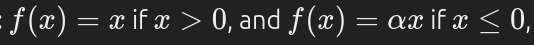

The sigmoid activation function takes real values as input and converts them to numbers between 0 and 1 using the sigmoid formula.

RELU

##### **Leaky ReLU**

- **Function:** 
 
 where α alphaα is a small constant (typically 0.01).
- **Description:** Allows a small, non-zero gradient when xxx is negative, which helps keep neurons active.
- **Pros:** Reduces the risk of dead neurons.
- **Cons:** Requires setting an additional parameter (α\alphaα).

