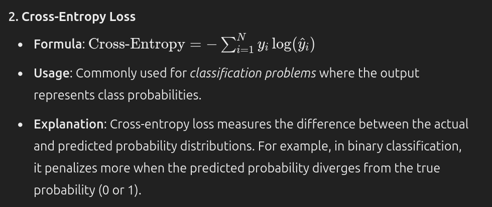
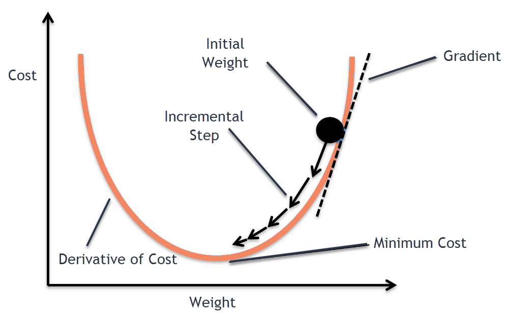
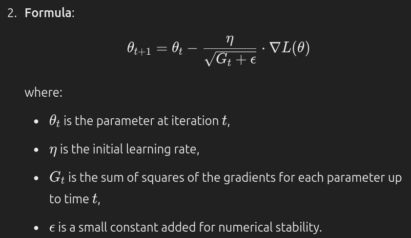
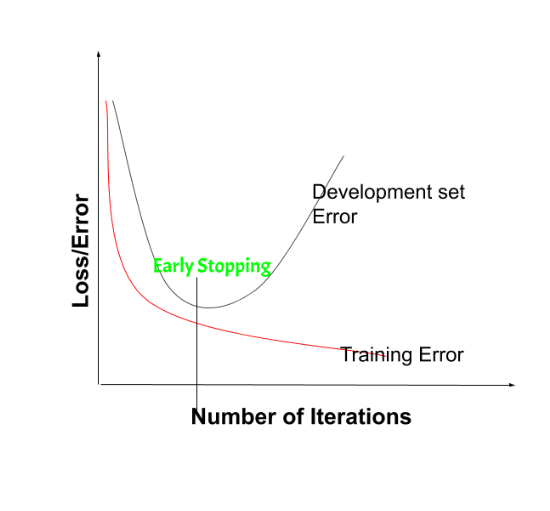

### MUlti Layered Feed forward network =  [[feedforward]]

---
### Learning factor 

In deep learning, the learning factor, commonly called the ==learning rate==, controls ==how much the model's weights are adjusted in response to the estimated error for each iteration.== It is a crucial ==hyperparameter== that determines the size of steps taken towards minimizing the loss function.

- **High learning rate**: Faster training but risks ==overshooting== the optimal solution, potentially missing out on accuracy.
- **Low learning rate**: ==More precise convergence== but ==slower training== and risk of getting ==stuck in local minima==.

The factors that improve the convergence of EBPTA (error backprapogation Through Activation ) are called as learning factors 

The factors are as follows:
1. Initial weights
2. Steepness of activation function
3. Learing constant
4. Momentum
5. Network architecture
6. Necessary number of hidden neurons

1. Initial weights:

- The weights of the network to be trained are typically initialized at small random values.
- The initialization strongly affects the ultimate solution
    

2. Steepness of activation function

- The neuron’s continuous activation function is characterized by its steepness factor
- Also the derivatice of the activation function serves as a multiplying factor in building components of the error signal vectors.

3. Learing constant:

- The effectiveness and convergence of the error back propagation learning algorithm depen significantly on the value of the learning constant.

4. Momentum:

- The purpose of the momentum method is ti ==accelerate the convergence== of the error back propagation learning algorithm.
- The method involves supplementing the current weight adjustment with a fraction of the most recent weight adjustment.

5. Network architecture:

- One of the most important attributes if a layerd neural network design is choosing the architecture
- The number of input nodes is simply determined by the dimension or size of the input vector to be classified. The input vector size usually corresponds to the total number of distinct features of the input patterns.

6. Necessary number of hidden neurons:

- This problem of choice of size of the hidden layer is under intensive study with no conclusive answers available.
- One formula can be used to find out how many hidden layer neurons need to be used to achieve classification into M classes in x dimensional patterns space.

---
### [[Activation Functions]]

---

### Loss Function

a _loss function_ ==quantifies the difference between a model's predictions and the actual target values==. It guides the training process by providing a ==feedback signal== that allows the model to ==adjust its weights to minimize error==. Choosing an appropriate loss function is crucial and often depends on the type of problem ==(e.g., regression vs. classification)== and the output layer's activation function.

**Output Activation**:

- **Binary Classification**: Use a ==_sigmoid_ activation== function in the output layer, which outputs values ==between 0 and 1==, making it suitable for binary cross-entropy.
- **Multi-Class Classification**: Use ==_softmax_ activation== in the output layer to produce a probability distribution over classes, suitable for categorical cross-entropy.

#### Choosing the Right Output Function and Loss Function

The choice of output layer activation and loss function combination depends on the task type:

- **Regression**:
    - **Output Activation**: None (linear output layer).
    - **Loss Function**: Mean Squared Error (MSE) or Mean Absolute Error (MAE).

- **Binary Classification**:
    - **Output Activation**: Sigmoid function, which outputs probabilities between 0 and 1.
    - **Loss Function**: Binary Cross-Entropy Loss.

- **Multi-Class Classification**:
    - **Output Activation**: Softmax function, which outputs a probability distribution across multiple classes.
    - **Loss Function**: Categorical Cross-Entropy Loss.

#### Why Matching the Output Activation and Loss Function Matters

The correct pairing ensures that the model outputs match the range and interpretation needed by the loss function. For example, if a sigmoid activation is paired with binary cross-entropy, the loss function expects outputs between 0 and 1, ==which aligns with the sigmoid’s output range==. Similarly, ==softmax aligns well with categorical cross-entropy, as both deal with probabilistic outputs over multiple classes.==

### Optimization techniques 

In deep learning, _optimization techniques_ are ==crucial for adjusting a model's weights to minimize the loss function==, ==helping the model to learn effectively and generalize well==. These techniques ==focus on optimizing gradient descent==, the core algorithm for training neural networks.

>In simple words, Optimization algorithms are responsible for reducing losses and provide most accurate results possible. The weight is initialized using some initialization strategies and is updated with each epoch according to the equation. The best results are achieved using some optimization strategies or algorithms called Optimizer.

### **_1. Gradient Descent_**

###### ==Iterative algorithm==, ==starts from a random point on the function== and ==traverses down its slope in steps until it reaches lowest point of that function.
==

This algorithm is ==apt for cases== where ==optimal points cannot be found by equating the slope of the function to 0==. For the function to reach minimum value, the weights should be altered. ==With the help of back propagation, loss is transferred from one layer to another and “weights” parameter are also modified depending on loss so that loss can be minimized==.

Drawbacks of GD

- As for Gradient Descent algorithm, the entire data set is loaded at a time. This makes it ==computationally intensive==
- there are chances the iteration values may get ==stuck at local minima== or saddle point and never converge to minima. To obtain the best solution, ==the must reach global minima.==

### 2. Stochastic Gradient Descent (SGD)

==Extension of GD== , overcomes disadvantages of GD 

SGD tries to overcome the disadvantage of ==computationally intensive by computing the derivative of one point at a time==
Due to this fact, SGD takes more number of iterations compared to GD to reach minimum and also contains some noise when compared to Gradient Descent
As SGD computes derivatives of only 1 point at a time, the time taken to complete one epoch is large compared to Gradient Descent algorithm.

### 3. Mini Batch — Stochastic Gradient Descent

==MB-SGD is an extension of SGD algorithm==. It overcomes the time-consuming complexity of SGD by taking a batch of points / subset of points from dataset to compute derivative.

> [!NOTE]
> It is observed that the derivative of loss function of MB-SGD is similar to the loss function of GD after some iterations. But the number iterations to achieve minima in MB-SGD is large compared to GD and is computationally expensive. The update of weights in much noisier because the derivative is not always towards minima.

### 4.AdaGrad

AdaGrad is an effective algorithm for specific cases with ==sparse data or high-dimensional feature spaces==, but its dim==inishing learning rate can be a drawbac==k for ==general-purpose deep learning tasks.==

**AdaGrad** (Adaptive Gradient Algorithm) is an optimization algorithm in deep learning that ==adapts the learning rate for each parameter individually== based on the ==historical gradients for that parameter==

**Adaptive Learning Rate**: Unlike standard gradient descent, ==AdaGrad modifies the learning rate for each parameter based on how frequently that parameter has been updated in the past.==

**Gradient Accumulation**: $G_t​$ is an accumulated sum of squared gradients over all previous steps, meaning parameters with high gradients slow down due to larger denominators, while parameters with lower gradients can speed up

==**Good for Sparse Data**:== AdaGrad performs well in situations with sparse features, such as natural language processing, where certain parameters (like rare words) may update infrequently. The adaptive nature of AdaGrad allows these rarely updated parameters to take larger steps.

#### Limitations: 
- Learning Rate Decay
- diminishing learning rate problem

**Applications**: AdaGrad is commonly used in scenarios with sparse data or where certain parameters require significantly different learning rates. However, because of its diminishing learning rate, it is less commonly used in deep networks without modification.

### 5. RMSprop (Root Mean Square Propagation)

optimization technique designed to address AdaGrad's diminishing learning rate problem, especially useful in deep learning tasks like training recurrent neural networks.

RMSprop uses an exponentially decaying average of past squared gradients to adjust the learning rate, preventing it from decaying too fast.

formula
$$
E[g2]t​=γE[g2]t−1​+(1−γ)⋅gt2​ θt+1=θt−ηE[g2]t+ϵ⋅gt\theta_{t+1} = \theta_t - \frac{\eta}{\sqrt{E[g^2]_t + \epsilon}} \cdot g_tθt+1​=θt​−E[g2]t​+ϵ
$$

where:
- E[g2]tE[g^2]_tE[g2]t​ is the exponentially decaying average of past squared gradients,
- gtg_tgt​ is the gradient at step ttt,
- γ\gammaγ (decay rate) is typically set around 0.9,
- η\etaη is the learning rate,
- ϵ\epsilonϵ is a small constant for numerical stability.

The exponential decay keeps the learning rate from becoming too small over time, making RMSprop ==suitable for non-stationary objectives==

**Applications**: RMSprop is widely used for tasks like training recurrent neural networks (RNNs) and other deep models that benefit from adaptive learning rates.

### Adam (Adaptive Moment Estimation)

**Adam** combines the ideas of both momentum and RMSprop, making it one of the most popular and effective optimization algorithms in deep learning.

Adam maintains two moving averages: one for the gradient ==(momentum)== and one for the squared gradient ==(adaptive learning rate).==

==**Bias Correction**:== The bias correction ensures stable updates, especially in the early training stages when the moment estimates may be biased toward zero.

==**Combines RMSprop and Momentum**==: Adam combines the per-parameter adaptive learning rate from RMSprop and the momentum concept, ==making it very effective for complex, noisy, and sparse data.==

**Applications**: Adam is widely used across various deep learning tasks, including ==CNNs, RNNs==, and large networks. Its robustness and ease of tuning make it a go-to optimizer.

### overfitting:

**Overfitting** in deep learning (and machine learning) occurs when a ==model learns the training data too well, capturing noise and random fluctuations==rather than the underlying pattern. This results in excellent performance on the training data but ==poor generalization to new, unseen data==, as the model has essentially "memorized" the training examples rather than learning general rules.

- **Symptoms**:
    
    - High accuracy on training data but low accuracy on validation/test data.
    - Increasing gap between training and validation error over epochs.
- **Causes**:
    
    - **Complex Model**: Using a model that has too many parameters relative to the amount of training data (e.g., very deep networks on small datasets).
    - **Insufficient Data**: A small or non-representative training dataset can lead to a model that only works well on specific examples.
    - **Too Many Training Epochs**: Training for too long can cause the model to start fitting to noise in the data rather than general patterns.

#### **Solutions to Overfitting**:

- **==Regularization==**: Techniques like L1/L2 regularization (penalizing large weights), Dropout (randomly turning off neurons during training), or ==Batch Normalization.==
- **Data Augmentation**: Expanding the dataset by applying transformations like rotation, scaling, or flipping to make the model more robust.
- ==**Early Stopping**:== Monitoring the validation loss and stopping training when it begins to increase.
- **Cross-Validation**: Using cross-validation to check if the model’s performance generalizes well across different subsets of the data.
- **Simplifying the Model**: Reducing the number of layers or neurons to prevent the model from fitting every detail of the training data.

### Bias

Bias is the ==error introduced by approximating== a real-world problem (which may be complex) with a simplified model. In essence, it represents the assumptions made by a model to learn the target function.

**High Bias**: A model with high bias ==makes strong assumptions about the data==, usually leading to ==underfitting==. It may oversimplify the data structure, failing to capture important patterns.

A low-bias model is ==flexible== and ==can fit the data closely==, with fewer simplifying assumptions.

**Characteristics of High-Bias Models**:

- Poor fit to the training data and test data (==underfitting==).
- ==Large error== in both the ==training and test sets==.
- ==High training error==.

### Variance

Variance is the ==model’s sensitivity to small fluctuations== in the training data. High-variance models ==capture a lot of noise from the training data==, which makes them more ==complex and prone to overfitting==.

**High Variance**: A model with high variance is overly complex, capturing noise as if it were a signal, leading to overfitting. This means the model performs well on the training data but poorly on new, unseen data.
**Low Variance**: Low-variance models are less sensitive to fluctuations in the training data and are generally simpler.

**Characteristics of High-Variance Models**:

- Good fit to the training data but poor fit to the test data (overfitting).
- High variance in model predictions across different datasets or samples.
- High test error.

### The Bias-Variance Tradeoff

The **bias-variance tradeoff** is about finding a balance between bias and variance to minimize the total error, allowing a model to generalize well to new data.

- **Bias Squared** $(\text{Bias}^2):$
    
    - Represents errors due to incorrect assumptions in the model (e.g., assuming linearity when the relationship is nonlinear).
    - High bias leads to underfitting, which increases training and test errors.
- **Variance**:
    
    - Represents errors due to the model’s sensitivity to small changes in the training set.
    - High variance leads to overfitting, where the model captures noise as if it were an actual pattern, reducing generalizability.
- **Irreducible Error**:
    
    - Represents noise inherent in the data that no model can capture, such as random error from measurement or unmodeled influences.
    - This error is inherent to the problem and cannot be reduced by the model.
#### Visual Representation of Bias-Variance Tradeoff

- **High Bias**: Error from bias is high, but error from variance is low. Total error is high due to underfitting.
- **High Variance**: Error from variance is high, but error from bias is low. Total error is high due to overfitting.
- **Optimal Point**: The sweet spot is where both bias and variance are balanced, resulting in the lowest possible error.

### Regularization in DL

Regularization in deep learning refers to techniques that prevent a model from overfitting by adding a penalty to the loss function. This penalty discourages the model from learning overly complex patterns that may capture noise instead of meaningful structures in the data. The two most common forms of regularization in deep learning are **L1** and **L2 regularization**.

### Why Use Regularization?

Regularization helps improve the generalization of a model by:

- Controlling the complexity of the model.
- Preventing it from assigning excessive importance to any single feature.
- Encouraging the model to rely on simpler patterns, which are more likely to generalize well.

### L1 and L2 Regularization

#### 1. **L2 Regularization** (Ridge Regularization)

- **Definition**: L2 regularization adds a penalty term that is proportional to the sum of the squared values of the weights.
    
- **Formula**: In L2 regularization, the regularized loss function is:
    
    
    
    where:
    
    - LLL is the original loss function (e.g., mean squared error or cross-entropy),
    - λ\lambdaλ is the regularization parameter (also called the penalty term), which controls the strength of the regularization,
    - wiw_iwi​ represents each individual weight in the model.
- **Effect on Weights**:
    
    - The L2 term encourages weights to become smaller but does not drive them exactly to zero.
    - By penalizing large weights, L2 regularization leads to models that are more distributed across multiple features rather than focusing heavily on any one feature.
- **Gradient Update with L2**:
    
    - During training, L2 regularization adjusts the weight update as: wi=wi−η⋅(∂L∂wi+λ⋅wi)w_i = w_i - \eta \cdot \left( \frac{\partial L}{\partial w_i} + \lambda \cdot w_i \right)wi​=wi​−η⋅(∂wi​∂L​+λ⋅wi​) where η\etaη is the learning rate.
    - This causes a "shrinkage" effect, where weights are scaled down in addition to the regular gradient update.
- **Use Cases**: L2 regularization is commonly used in regression problems and deep learning models where we want to avoid overly large weights but still retain small contributions from multiple features.
    

---

#### 2. **L1 Regularization** (Lasso Regularization)

- **Definition**: L1 regularization adds a penalty that is proportional to the sum of the absolute values of the weights.
    
- **Formula**: In L1 regularization, the regularized loss function LregL_{\text{reg}}Lreg​ is:
    
    
    
    where:
    
    - LLL is the original loss function,
    - λ\lambdaλ is the regularization parameter,
    - ∣wi∣|w_i|∣wi​∣ denotes the absolute value of each weight.
- **Effect on Weights**:
    
    - L1 regularization promotes sparsity, meaning it encourages some weights to become exactly zero. This effectively removes certain features from the model, making it simpler and focusing only on the most significant features.
    - This can lead to sparse models that are easier to interpret, as irrelevant features are "zeroed out."
    - 
- **Use Cases**: L1 regularization is used when feature selection is desired, such as in sparse data scenarios where some features are irrelevant. It is often applied in fields like natural language processing and computer vision.
#### Choosing Between L1 and L2 Regularization

- **L2 Regularization**:
    - Useful when you want all features to contribute a bit and don’t necessarily want to remove any entirely.
    - Effective for situations where features are dense, and feature selection is not required.

- **L1 Regularization**:
    - Preferable if you suspect only a few features are important and you want the model to ignore irrelevant features.
    - Helps create sparse models, especially useful in high-dimensional data where certain features are redundant.

### Parameter sharing

**Parameter sharing** in deep learning refers to the ==practice of reusing the same set of parameters (weights) across multiple parts of a model==, rather than having separate parameters for each connection or node. This approach is especially ==beneficial for reducing the number of parameters in the model==, saving memory, improving computational efficiency, and ==enhancing generalization==.

most commonly used in CNN ( convolutional Neural Networks ) and RNN ( Recurrent Neural Network )

#### Advantages
- Reduces the number of parameter 
- improve generalization
- Enable translation and time Invarience

### Dropout in Deeplearning

**Dropout** is a ==regularization technique== used in deep learning to ==prevent overfitting==, particularly in large neural networks. It involves ==randomly== "dropping out" (i.e., ==setting to zero==) a subset of neurons during training. ==This means that each neuron has a fixed probability of being temporarily ignored, or deactivated, on each training iteration.==

**Randomly Deactivating Neurons**
-  For example, with a ==dropout rate of 0.5==, approximately 50% of the neurons are dropped out in each training iteration.
**Effect on Forward Pass and Backward Pass**
- During the forward pass, the deactivated neurons do not contribute to the output.
- In the backward pass, no gradient is computed for these deactivated neurons, effectively treating them as if they don’t exist for that iteration.
#### Why Dropout Helps Prevent Overfitting

1. **Creates Redundant Representations**:
    
    - Dropout forces the network to avoid relying too heavily on any single neuron or subset of neurons.
    - This ==encourages the network to learn more distributed and redundant representations of features==, making it more ==robust== to small variations in input.
2. **Prevents Co-adaptation of Neurons**:
    
    - When neurons are "dropped out" randomly, they cannot co-adapt (i.e., form dependencies on each other’s outputs) because they might not be active together in any given forward pass.
    - This prevents the network from "==memorizing==" the training data and helps it ==generalize better to unseen data==.
3. **Acts as an Ensemble of Networks**:
    
    - Dropout can be thought of as training a collection of different "sub-networks" within the original network.
    - Each sub-network is trained on a different random selection of active neurons, so the final network during inference represents an average of multiple smaller networks, which enhances generalization.

#### Choosing the Dropout Rate

- Common ==dropout rates range from 0.2 to 0.5==, but the optimal rate depends on the architecture and dataset.
==- Lower dropout rates (e.g., 0.2) are often used in the early layers, where features are more general, while higher rates (e.g., 0.5) may be used in later layers to encourage feature diversity.==

#### Advantages of Dropout

- **Reduces Overfitting**: By preventing neurons from co-adapting, dropout reduces the likelihood of overfitting, especially in deep networks with many parameters.
- **Improves Generalization**: Dropout encourages the model to learn distributed representations, which improves generalization to unseen data.

#### Limitations of Dropout

- **Training Time**: Dropout increases the training time since each neuron needs to learn without relying on specific neurons being active every time.
- **Not Always Effective**: In some networks (e.g., recurrent neural networks), dropout can lead to reduced performance if not applied carefully.

### Weight Decay ( L2 regularization )

Weight decay is a regularization technique used in deep learning to prevent overfitting of neural networks by adding a penalty on the size of weights in the model.

**Weight Decay**, or L2 **Regularization**, is a regularization technique applied to the weights of a neural network. We minimize a loss function compromising both the primary loss function and a penalty on the L2 Norm of the weights:

where ( lambda ) is a value determining the strength of the penalty (encouraging smaller weights).

The term "weight decay" is commonly used to refer to a specific form of regularization called **L2 regularization**

	Weight decay help to Conquire overfitting problem 
	
>Weight decay is implemented by adding a penalty term to the loss function.

 The penalty term discourages large weights, making the model simpler and improving generalization on new data.

**Benefits**:

- **Prevents overfitting** by reducing model sensitivity.
- **Encourages smoother predictions** and simpler models.

### Batch Normalization

Batch normalization (BN) stabilizes and accelerates training in deep neural networks by normalizing the inputs to each layer.

**Benefits**:

- **Faster Training**: Reduces the internal covariate shift, allowing higher learning rates.
- **Improved Stability**: Makes training more stable, reducing the need for careful initialization.
- **Reduces Overfitting**: Acts as a regularizer, reducing the need for other forms of regularization (like dropout).
- 
**Where to Apply**: Typically added before the activation function in each layer, especially in deep networks (e.g., CNNs, RNNs).

>Helps models converge faster, reduces sensitivity to initialization, and can improve model generalization.

### Early Stopping

>Early stopping is a form of regularization used to prevent overfitting in machine learning and deep learning models. It involves stopping the training process before the model starts to overfit. The idea is to monitor the model’s performance on a validation set during the training process and stop training when the performance starts to degrade, which is an indication that the model is beginning to overfit the training data.

Stops training when performance on a validation set stops improving, preventing overfitting

**Working**: Monitors validation loss; if it doesn’t improve for a set number of epochs (patience), training halts.

**Benefits**:

- **Prevents Overfitting**: Stops before the model starts fitting noise in the training data.
- **Saves Resources**: Reduces training time by stopping early.

**Where to Use**: Common in any iterative training process, especially for deep networks.

### Data augmentation

>Expands training data by creating modified versions of existing samples to improve model generalization.

**Techniques**:

- **Image**: Random rotations, flips, crops, brightness adjustments.
- **Text**: Synonym replacement, random insertion/deletion of words.
- **Audio**: Pitch shift, time stretch, noise addition

- **Benefits**:
    - **Reduces Overfitting**: Increases data diversity, helping models generalize better.
    - **Improves Robustness**: Trains the model on more varied inputs, making it more resilient.
- **Where to Use**: Common in image, audio, and text data when datasets are limited.

### Adding Noise to Input  (Gaussian noise)

- **Purpose**: Makes the model robust by training it on slightly noisy inputs.
- **How it Works**: Adds small, random noise to input data during training (e.g., Gaussian noise for images).
- **Benefits**:
    - **Improves Generalization**: Forces the model to focus on essential patterns rather than memorizing exact data points.
    - **Resilience to Variations**: Helps the model handle noisy real-world data better.
- **Where to Use**: Common in image and audio data, and applicable to other types where noise is realistic.

### Adding Noise to Output (Label Smoothing)

1. **Purpose**: Softens the model’s confidence on predictions to avoid overfitting on exact labels.
2. **How it Works**: Adjusts true labels to be less confident (e.g., 0.9 for correct class, 0.1 for others), reducing sensitivity to label noise.
3. **Benefits**:
    - **Prevents Overconfidence**: Makes the model less likely to overfit by preventing extreme confidence.
    - **Improves Generalization**: Reduces the gap between training and test performance.
4. **Where to Use**: Common in classification tasks where exact class boundaries are less clear.