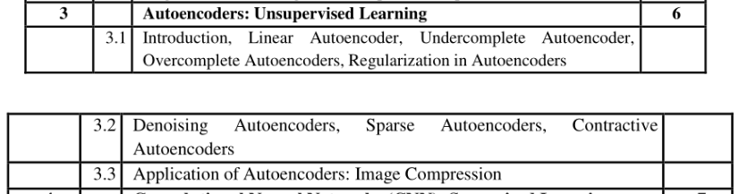

	### Syllabus

### What is Autoencoders 

Autoencoders are a ==type of neural network architecture== used primarily for **==unsupervised learning==** tasks, where the goal is to learn a compressed, efficient representation of input data. They are often used for ==**dimensionality reduction**, **feature learning**, **denoising**, and **data generation**.==

**Encoder**: Maps the input data to a lower-dimensional, compressed representation called a **latent space** or **bottleneck**.

**Latent Representation:** The most crucial characteristics of the input data are captured by the latent representation. It is a compact, concentrated depiction that ideally retains the most important information.

**Decoder**: Reconstructs the input data from the compressed representation.

The network’s goal is to minimize the difference between the original input and its reconstruction, often measured with a ==loss function== (e.g., mean squared error for images).

**Working:** 
- The encoder ==reduces the dimensionality of the data==, capturing essential features.
- The ==decoder tries to rebuild the original data== from this compressed form, learning important patterns and structures in the data.

**Applications:**

- **Dimensionality Reduction**: Used as an alternative to PCA for compressing high-dimensional data.
- **Anomaly Detection**: Detect outliers by identifying inputs with high reconstruction errors.
- **Denoising**: Removes noise from corrupted data, especially in image and audio processing.
- **Image Generation**: Variational Autoencoders can generate new, realistic images based on learned data distributions.
 
 **Limitations of Autoencoders:**
- **Need for Large Datasets**: Require substantial data to learn useful representations.
- **Non-Generalizable**: Trained on specific data distributions and may not generalize well to unfamiliar data.

Here’s a breakdown of each type of autoencoder with key points for each:

---

### 1. Linear Autoencoder

- **Purpose**: Primarily used for ==dimensionality reduction==, similar to Principal Component Analysis ==(PCA).==
- **Structure**: ==Uses linear activation functions ==(instead of nonlinear ones like ReLU or Sigmoid) in both the encoder and decoder.
- **Characteristics**:
  - ==Performs similarly to PCA== when the encoder and decoder are linear.
  - Learns a lower-dimensional representation by projecting data onto a linear subspace.
  - Not widely used in practice because nonlinear autoencoders generally perform better in capturing complex patterns.
- **Use Case**: Useful as a conceptual== bridge between autoencoders and PCA==.

---

### 2. Undercomplete Autoencoder

- **Purpose**: Designed to learn a compressed representation by ==creating a bottleneck with fewer neurons than the input dimensions.==
- **Structure**: The ==latent space (bottleneck) is smaller than the input==, forcing the network to learn the most important features.
- **Characteristics**:
  - Helps in removing redundant information and focusing on essential features.
  - Works well for dimensionality reduction and feature extraction.
- **Use Case**: Effective for applications where the goal is to learn a compact representation of the data.

---

### 3. Overcomplete Autoencoder

- **Purpose**: Has a ==latent space larger than the input dimension==, creating an overcomplete representation.
- **Structure**: More neurons in the bottleneck layer than in the input, which can lead to high capacity for storing data.
- **Characteristics**:
  - Risk of learning a near-perfect identity mapping, which may lead to overfitting if regularization is not applied.
  - To avoid learning trivial mappings, additional constraints (e.g., sparsity) are often added.
- **Use Case**: Can be useful with added regularization (like sparsity or noise) to learn richer features.

---

### 4. Denoising Autoencoder

- **Purpose**: Designed to **remove noise** from data ==by learning to reconstruct the original input from a noisy version.==
- **Structure**: The input data is deliberately corrupted (e.g., adding Gaussian noise), and the autoencoder is trained to reconstruct the clean version.
- **Characteristics**:
  - Encourages the model to learn robust features that are invariant to noise.
  - Forces the autoencoder to learn general patterns instead of memorizing data.
- **Use Case**: Commonly used in image and audio processing for noise reduction and in scenarios where robust representations are needed.

---

### 5. Sparse Autoencoder

- **Purpose**: Learns features with ==sparse activations== by encouraging the majority of neurons to be inactive ==(close to zero)== for a given input.
- **Structure**: Often has an ==overcomplete architecture with additional regularization (e.g., L1 regularization)== to enforce sparsity in the bottleneck layer.
- **Characteristics**:
  - Allows the network to learn interpretable features, as each neuron in the bottleneck becomes sensitive to specific patterns.
  - Reduces overfitting by making the network focus on a smaller subset of the neurons for each input.
- **Use Case**: Effective in feature learning, especially in cases where sparse representations are beneficial (e.g., image recognition, natural language processing).

---

### 6. Contractive Autoencoder

- **Purpose**: Designed to make the model robust to small input variations by ==penalizing the sensitivity== of the bottleneck representation.
- **Structure**: Adds a regularization term to the loss function, penalizing the gradient of the encoder’s output with respect to the input, which minimizes changes in the representation for small input changes.
- **Characteristics**:
  - Encourages the model to ==learn smooth mappings== and to be ==invariant to minor input variations.==
  - ==Enhances robustness and generalization==.
- **Use Case**: Commonly used when input data may have slight variations, such as in ==image recognition or sensor data, and robustness is critical==.

---

### Regularization in Autoencoders

Regularization in autoencoders refers to techniques that help improve the model's generalization and prevent it from learning trivial solutions (like copying the input directly). Regularization in autoencoders is especially important because autoencoders can easily learn to memorize the input without extracting meaningful features, which makes them less useful for tasks like dimensionality reduction, anomaly detection, and feature learning. Here are some common regularization methods used in autoencoders:

---

#### 1. **Sparse Regularization**
   - **Purpose**: Encourages only a subset of neurons in the hidden layer to activate for each input, leading to a sparse representation.
   - **Method**: Adds a penalty (like L1 regularization) to force some of the activations in the bottleneck layer to be close to zero.
   - **Benefit**: Helps the autoencoder learn interpretable and compact representations by focusing on the most important features.
   - **Application**: Sparse autoencoders are commonly used in feature learning and image processing.

#### 2. **Denoising Regularization**
   - **Purpose**: Makes the model robust to noise by adding random noise to the input and training the autoencoder to reconstruct the original, clean input.
   - **Method**: Applies noise (e.g., Gaussian noise, masking noise, or dropout) to the input before feeding it into the encoder.
   - **Benefit**: Forces the autoencoder to learn stable, noise-invariant representations and prevents it from simply copying the input.
   - **Application**: Denoising autoencoders are often used for image denoising, anomaly detection, and pretraining for downstream tasks.

#### 3. **Contractive Regularization**
   - **Purpose**: Reduces sensitivity to small changes in the input, making the representation smoother and more robust to small variations.
   - **Method**: Adds a penalty on the Frobenius norm of the Jacobian matrix of the encoder’s activations with respect to the input, encouraging minimal variation in the representation.
   - **Benefit**: Encourages the model to learn features that are robust to slight changes, making it useful for feature extraction.
   - **Application**: Often used in applications where robustness to small changes in input is important, like image and signal processing.

#### 4. **Dropout Regularization**
   - **Purpose**: Prevents overfitting by randomly dropping neurons during training, encouraging the network to learn redundant representations.
   - **Method**: Randomly drops a subset of neurons (both in encoder and decoder layers) during training, which forces the model to distribute the learned features across multiple neurons.
   - **Benefit**: Reduces over-reliance on any single neuron, improving generalization and preventing the autoencoder from memorizing the data.
   - **Application**: Commonly used in deep autoencoders for large datasets to ensure robust learning.

#### 5. **Variational Regularization (for Variational Autoencoders)**
   - **Purpose**: Forces the latent space to follow a specified distribution, allowing the autoencoder to generate new data samples.
   - **Method**: Adds a Kullback-Leibler (KL) divergence loss to ensure the latent representation approximates a standard normal distribution.
   - **Benefit**: Useful for generating new data (like synthetic images or text), and smooths the latent space so similar inputs produce similar encodings.
   - **Application**: Used in Variational Autoencoders (VAEs) for tasks like data generation, anomaly detection, and representation learning.

#### 6. **Early Stopping**
   - **Purpose**: Prevents overfitting by stopping training when performance on a validation set stops improving.
   - **Method**: Monitors validation loss; if there is no improvement after a set number of epochs (patience), training is halted.
   - **Benefit**: Reduces overfitting, ensures the model doesn’t memorize data, and saves computational resources.
   - **Application**: Widely used in any training process where generalization is important, including autoencoder training.

#### 7. **Weight Regularization (L1 and L2 Regularization)**
   - **Purpose**: Reduces the complexity of the model by penalizing large weights, which can prevent overfitting.
   - **Method**: Adds a penalty term to the loss function—L1 regularization penalizes the absolute value of weights (making some weights zero), while L2 regularization penalizes the square of weights (encouraging smaller weights).
   - **Benefit**: Encourages simpler models with smaller weights that generalize better.
   - **Application**: Useful for controlling complexity in overcomplete autoencoders, where the latent space is larger than the input.

---

###  Applications of Autoencoder

**Image and Audio Compression:** Autoencoders can compress huge images or audio files while  maintaining most of the vital information. An autoencoder is trained to recover the original picture or audio file from a compressed representation.

**Anomaly Detection:** One can detect anomalies or outliers in datasets using autoencoders. Training the autoencoder on a dataset of normal data and any input that the autoencoder cannot accurately reconstruct is called an anomaly.

**Dimensionality Reduction:** Autoencoders can lower the dimensionality of high-dimensional datasets. We can accomplish this by teaching an autoencoder a lower-dimensional data representation that captures the most relevant features.

**Data Generation:** Employ autoencoders to generate new data similar to the training data. One can accomplish this by sampling from the autoencoder’s compressed representation and then utilizing the decoder to create new data.

**Denoising:** One can utilize autoencoders to reduce noise from data. We can accomplish this by teaching  
an autoencoder to recover the original data from a noisy version.

**Recommender System: Using autoencoders, we can us**e users’ preferences to generate personalized suggestions. We can accomplish this by training an autoencoder to learn a compressed representation of the user’s history of system interactions and then utilizing this representation to forecast the user’s preferences for new items.

