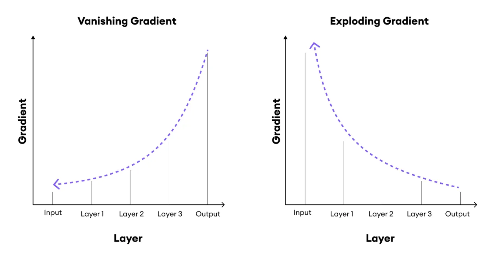

The **vanishing gradient** and **exploding gradient** problems are issues encountered in training deep neural networks, especially Recurrent Neural Networks (RNNs), that involve long sequences. These problems can make it difficult for RNNs to learn long-term dependencies and effectively propagate information through time steps. Here’s a detailed explanation of each:

---

### 1. **Vanishing Gradient Problem**

   - **Definition**: The vanishing gradient problem occurs when the gradients of the loss function become very small as they are backpropagated through each time step in the RNN. This results in gradients shrinking exponentially, which prevents weights from being updated effectively.

   - **Cause**:
     - RNNs update their weights based on gradients calculated at each time step.
     - During backpropagation through time (BPTT), these gradients are multiplied at each layer (or time step), which can lead to them becoming very small due to repeated multiplication of numbers less than one (common when activation functions like sigmoid or tanh are used).
     - As a result, the information from earlier time steps has minimal impact on later time steps, making it challenging for RNNs to capture long-term dependencies.

   - **Effect**: 
     - The model "forgets" important earlier information in the sequence, making it ineffective at learning long-range dependencies.
     - Training becomes slow and ineffective, as weights do not change significantly, especially for layers or time steps far from the final output.

   - **Example**: In natural language processing, the vanishing gradient problem might prevent an RNN from understanding the context of words or phrases that appeared much earlier in a sentence.

---

### 2. **Exploding Gradient Problem**

   - **Definition**: The exploding gradient problem occurs when the gradients grow exponentially during backpropagation, causing excessively large weight updates and making the model unstable.

   - **Cause**:
     - When the gradient is repeatedly multiplied across many time steps, and if weights are large or activations lead to values greater than one, the gradients can become very large.
     - This causes the parameters to change drastically with each update, leading to unstable training and potentially causing the model to diverge.

   - **Effect**: 
     - The exploding gradient problem causes extremely large weight updates, which can result in numerical instability (e.g., NaN values) and make the model unusable.
     - The model's loss may oscillate wildly or increase dramatically, preventing convergence.

---

### 3. **Solutions to Vanishing and Exploding Gradients**

   - **Gradient Clipping**:
     - A technique to handle exploding gradients by setting a threshold value. If gradients exceed this threshold, they are scaled down to a manageable size.
     - This prevents gradients from becoming excessively large, stabilizing the training process.

   - **Advanced Architectures**:
     - **LSTM (Long Short-Term Memory)** and **GRU (Gated Recurrent Unit)** are RNN variants specifically designed to handle the vanishing gradient problem.
     - These architectures use gates to control information flow, making it easier to retain long-term dependencies.

   - **Better Initialization Techniques**:
     - Using proper initialization methods, like Xavier or He initialization, can help prevent weights from starting at values that cause gradients to explode or vanish.
  
   - **Alternative Activation Functions**:
     - The choice of activation function can impact gradient flow. ReLU (Rectified Linear Unit) and its variants (e.g., Leaky ReLU) are sometimes used in RNNs to mitigate vanishing gradients, though they are less common in RNNs than in other types of neural networks.

---

### 4. **Why Vanishing and Exploding Gradients are More Common in RNNs**

   - **Sequential Multiplications**: RNNs compute gradients across each time step, leading to repetitive multiplication, which can exacerbate gradient issues.
   - **Long Sequences**: RNNs, especially when applied to long sequences, require information to flow over many time steps, making it more likely for gradients to either shrink or grow uncontrollably.

---

### 5. **Conclusion**
   - The vanishing and exploding gradient problems are fundamental issues in training RNNs on long sequences. Addressing these problems is essential for successful training of RNNs, particularly in applications involving long-term dependencies. Solutions like LSTMs, GRUs, gradient clipping, and better initialization techniques have made it possible to train deep RNNs effectively.

---

### Summary for Exam Answer

- **Define** vanishing and exploding gradients.
- Explain their **causes** and **effects**.
- Mention **solutions** like gradient clipping, advanced architectures (LSTM/GRU), and better initialization.
- Describe why these problems are especially relevant to RNNs.

This provides a structured answer on vanishing and exploding gradients, covering key points for an exam response.