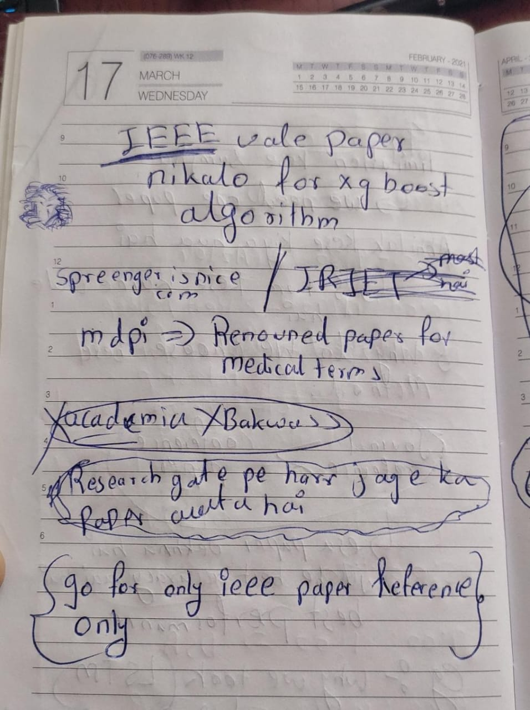

- our paper is outcome based paper
- atleast 30 references papers (2021-2024)
- abstract
- introduction
- proposed methodology
	- flowchart (rule based flowchart)
	- algorithm
- data collection (sources, steps , description)
- output (show as a screenshot)
- conclusion
- futurescope

https://easychair.org/cfp/country.cgi?cc=in

> [!NOTE]
> make stuff fancy 
> graphs are very important
> formulas 

---
### conferences

https://easychair.org/cfp/LogisticsSCAnalytics2025

---

## mujhe video present karna pada so os switch karna pada , iisiliye hand written notes likhe 

---

---

--- 

# last main thoda bore hua iisiliye pehali barr drawing nikal li

